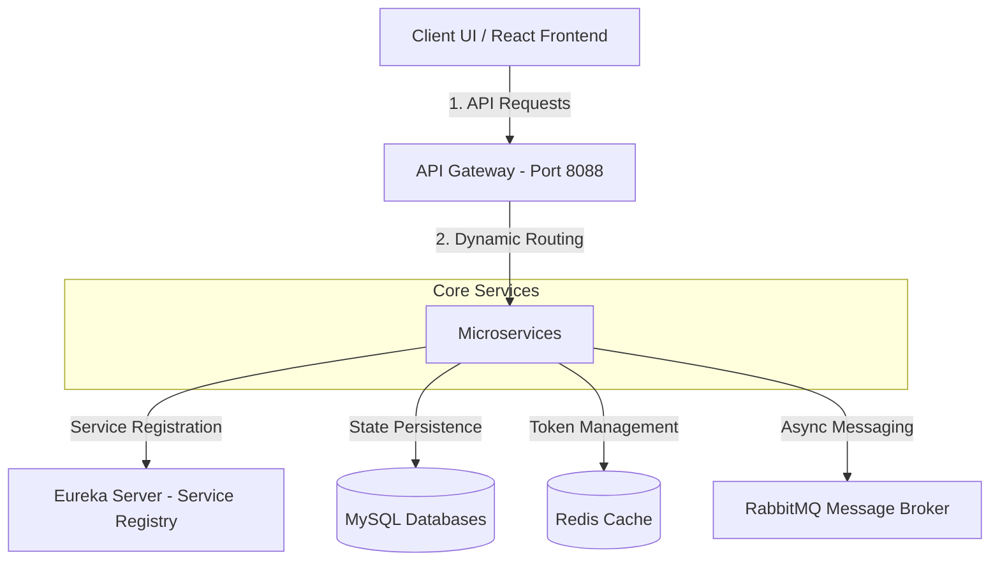

# 01. Project Overview

## 1. Introduction & System Purpose

The **ĐồCũ** (meaning "Secondhand Goods" in Vietnamese) platform is a modern, responsive Consumer-to-Consumer (C2C) microservices-based secondhand e-commerce application. The platform provides a digital marketplace tailored for local communities, allowing users to buy, sell, and exchange pre-owned goods (electronics, fashion, furniture, etc.) in a sustainable manner.

By decomposing functionalities into specialized microservices, the system achieves high scaling potential, separate databases per service, dynamic product search capabilities, real-time communication, and secure online transaction capabilities.

---

## 2. Business Domain

The project resides in the **C2C E-commerce and Secondhand Trading** business domain. Key business drivers and characteristics of this domain include:

* **Local/Geographic Context**: Product listings include location metadata (e.g. city, district, GPS coordinates) to facilitate physical inspections and offline exchanges.
* **Trust & Reputation**: A peer review system establishes user trust. Buyers can rate and comment on sellers after transactions, and sellers can reply to reviews.
* **Negotiation & Real-Time Engagement**: Used goods marketplaces rely heavily on chat negotiations. Integrated messaging bridges the communication gap between buyers and sellers directly inside the app.
* **Ad-hoc Attributes**: Unlike standardized e-commerce (e.g. Amazon), secondhand items vary wildly. The system implements dynamic attributes in text/JSON format to accommodate arbitrary specifications (e.g. battery health, wear-and-tear descriptions).

---

## 3. Key Platform Features

The system offers a comprehensive suite of features split across its microservices architecture:

1. **User Authentication & Profiles**:
   * Secure registration, login, and logout.
   * Dual-token authentication (JWT access token + Redis-backed Refresh Token).
   * Interactive profile management, including editing name, phone, and uploading custom avatars.
2. **Product Catalog & Search**:
   * Browse products by dynamic categories.
   * Rich search filters (keyword, category, location, min/max price, wear-and-tear condition).
   * "Bumping" mechanism allowing sellers to bump their products to the top of search listings.
   * Favorite/saved list to track interesting posts.
3. **Admin Dashboard**:
   * Moderation workflows (admin approval/disapproval of listings).
   * User management and category creation/updates.
4. **Negotiation Chat**:
   * Dynamic chat room creation tied to specific products.
   * Multimedia messages (text, custom image uploads, Google Maps location sharing).
   * Read/unread tracking and real-time counter indicators.
5. **Real-time Notifications**:
   * Sub-system to capture events (e.g. new chat message) and notify the receiver.
   * Persistent database records of notifications with read status.
6. **Seller Review System**:
   * Submitting seller reviews (1-5 star ratings, comments, and file attachments).
   * Seller response/reply capabilities to counter or accept feedback.
   * Automated calculations for seller average scores.
7. **Online Payments**:
   * Integration with **VNPay**, one of Vietnam's leading payment gateways.
   * Secure URL generation for redirection and HMAC-SHA512 checksum callbacks.

---

## 4. User Roles

The platform defines three main user roles:

| Role | Access Level | Key Capabilities |
| --- | --- | --- |
| **GUEST** (Anonymous) | Public | Browse landing page, search and filter listings, view product details, check seller profiles and reviews. |
| **USER** (Authenticated) | Registered User | Log in/out, edit profile settings, post new items for sale, bump active posts, save favorite items, open chat rooms, exchange messages (text, image, location), review sellers, write comments, create mock orders, and simulate VNPay payments. |
| **ADMIN** | Platform Administrator | All capabilities of a `USER`, plus access to the Admin Panel (`/admin`) to list, approve, or delete products, manage users, and manage categories. |

---

## 5. High-Level Data Flow

1. **Request Ingestion**: The React frontend routes all API calls to the central **API Gateway** (port `8088`).
2. **Security Decoupling**: The API Gateway intercepts the request, validates the JWT, decodes user identity, injects header details (`X-User-Id`, `X-User-Role`), and forwards it to downstream services.
3. **Synchronous Call Resolution**: When services need data from each other (e.g. `order-service` requesting buyer details), they perform internal HTTP REST queries using a load-balanced `RestTemplate` mapped via **Eureka Server**.
4. **Asynchronous Notification Propagation**: Non-blocking workflows (e.g. dispatching notification alerts or post-order tasks) publish messages to **RabbitMQ**, which are picked up by listeners on respective services for background processing.
