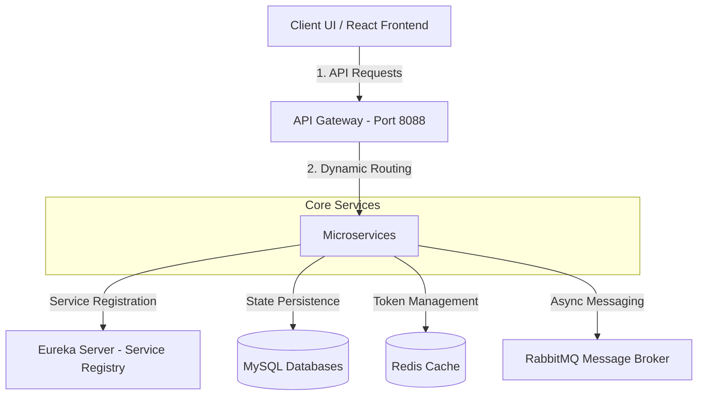

# 01. Tổng quan dự án

## 1. Giới thiệu & Mục tiêu hệ thống

Hệ thống **ĐồCũ** là một ứng dụng thương mại điện tử trao đổi đồ cũ theo mô hình C2C (Consumer-to-Consumer) hiện đại, được xây dựng dựa trên kiến trúc microservices và thiết kế giao diện responsive. Nền tảng này cung cấp một chợ trực tuyến tiện lợi cho cộng đồng địa phương, cho phép người dùng đăng tin bán, tìm kiếm, trao đổi các mặt hàng đã qua sử dụng (thiết bị điện tử, thời trang, nội thất...) một cách bền vững.

Bằng cách phân rã các tính năng nghiệp vụ thành các microservice chuyên biệt, hệ thống đạt được khả năng mở rộng cao, cô lập cơ sở dữ liệu cho từng dịch vụ, cung cấp bộ lọc tìm kiếm sản phẩm động, hệ thống chat thời gian thực và khả năng thực hiện các giao dịch trực tuyến an toàn.

---

## 2. Lĩnh vực nghiệp vụ (Business Domain)

Dự án nằm trong lĩnh vực **Thương mại điện tử C2C và Trao đổi đồ cũ**. Các đặc điểm và yếu tố thúc đẩy nghiệp vụ chính bao gồm:

* **Bối cảnh địa lý/địa phương**: Danh sách sản phẩm chứa thông tin vị trí (tỉnh/thành phố, quận/huyện, tọa độ GPS) để người mua dễ dàng xem hàng trực tiếp và giao dịch trực tiếp.
* **Độ tin cậy & Uy tín**: Hệ thống đánh giá ngang hàng (peer review) giúp thiết lập niềm tin. Người mua có thể đánh giá và bình luận về người bán sau khi giao dịch, và người bán có thể phản hồi lại.
* **Thương lượng & Tương tác thời gian thực**: Thị trường đồ cũ phụ thuộc lớn vào việc thương lượng giá cả. Hệ thống tích hợp tính năng chat giúp kết nối trực tiếp người mua và người bán ngay trên ứng dụng.
* **Thuộc tính sản phẩm động (Ad-hoc Attributes)**: Không giống hàng mới có thông số chuẩn, đồ cũ rất đa dạng. Hệ thống triển khai các thuộc tính động dưới dạng văn bản/JSON để lưu trữ thông số linh hoạt (ví dụ: tình trạng pin, vết xước...).

---

## 3. Các tính năng chính của nền tảng

Hệ thống cung cấp một bộ tính năng toàn diện được phân chia qua các microservice:

1. **Quản lý tài khoản & Xác thực**:
   * Đăng ký, đăng nhập và đăng xuất an toàn.
   * Cơ chế xác thực kép (Access Token JWT thời hạn ngắn + Refresh Token lưu ở Redis thời hạn dài).
   * Trang quản lý thông tin cá nhân (đổi tên, số điện thoại, tải ảnh đại diện).
2. **Danh mục sản phẩm & Tìm kiếm**:
   * Duyệt sản phẩm theo các danh mục động.
   * Bộ lọc tìm kiếm chi tiết (từ khóa, danh mục, vị trí, khoảng giá, tình trạng hao mòn).
   * Tính năng "Đẩy tin" (bump) giúp người bán đưa tin đăng lên đầu trang tìm kiếm.
   * Danh sách tin đăng đã lưu (yêu thích) để theo dõi sản phẩm quan tâm.
3. **Trang quản trị (Admin Dashboard)**:
   * Quy trình kiểm duyệt tin đăng (admin duyệt/từ chối duyệt sản phẩm).
   * Quản lý người dùng và cập nhật/tạo mới danh mục.
4. **Chat thương lượng**:
   * Tự động tạo phòng chat liên kết với từng sản phẩm cụ thể.
   * Gửi tin nhắn đa phương tiện (văn bản, tải ảnh trực tiếp, chia sẻ vị trí qua liên kết Google Maps).
   * Trạng thái đã đọc/chưa đọc và bộ đếm tin nhắn chưa đọc thời gian thực.
5. **Thông báo thời gian thực**:
   * Hệ thống con nắm bắt các sự kiện (ví dụ: tin nhắn mới) và gửi cảnh báo tới người nhận.
   * Lưu trữ lịch sử thông báo trong database với trạng thái đã đọc.
6. **Hệ thống đánh giá người bán**:
   * Gửi đánh giá cho người bán (1-5 sao, nhận xét và ảnh đính kèm).
   * Người bán có thể phản hồi lại các đánh giá từ khách hàng.
   * Tự động tính điểm đánh giá trung bình (average score) cho người bán.
7. **Thanh toán trực tuyến**:
   * Tích hợp cổng thanh toán **VNPay** (cổng thanh toán phổ biến tại Việt Nam).
   * Tạo URL thanh toán an toàn và kiểm tra chữ ký callback bằng thuật toán mã hóa HMAC-SHA512.

---

## 4. Các vai trò người dùng (User Roles)

Hệ thống định nghĩa ba vai trò người dùng chính:

| Vai trò | Mức độ truy cập | Các tính năng chính |
| --- | --- | --- |
| **GUEST** (Khách ẩn danh) | Công khai | Xem trang chủ, tìm kiếm và lọc sản phẩm, xem chi tiết sản phẩm, xem hồ sơ người bán và đánh giá của họ. |
| **USER** (Thành viên) | Đã đăng nhập | Đăng nhập/xuất, chỉnh sửa trang cá nhân, đăng tin bán đồ cũ, đẩy tin đang hoạt động, lưu tin yêu thích, tạo phòng chat, gửi tin nhắn (chữ, ảnh, vị trí), đánh giá người bán khác, tạo đơn hàng mô phỏng và chạy luồng thanh toán qua VNPay. |
| **ADMIN** (Quản trị viên) | Toàn quyền quản trị | Có toàn bộ quyền của `USER`, đồng thời truy cập trang Admin (`/admin`) để duyệt/xóa tin đăng, quản lý người dùng và danh mục sản phẩm. |

---

## 5. Luồng dữ liệu mức cao (High-Level Data Flow)

1. **Nhận yêu cầu**: Ứng dụng React Frontend gửi tất cả các yêu cầu API đến điểm truy cập tập trung **API Gateway** (port `8088`).
2. **Xác thực phi tập trung**: API Gateway chặn yêu cầu, xác thực token JWT, giải mã thông tin người dùng, thêm các trường tiêu đề (`X-User-Id`, `X-User-Role`) và chuyển tiếp xuống các dịch vụ nội bộ.
3. **Truy vấn đồng bộ**: Khi các dịch vụ cần dữ liệu trực tiếp của nhau (ví dụ: `order-service` cần kiểm tra thông tin người mua), chúng thực hiện cuộc gọi REST qua `RestTemplate` được tải động từ **Eureka Server**.
4. **Lan truyền sự kiện bất đồng bộ**: Các quy trình không chặn (ví dụ: bắn thông báo hoặc xử lý sau khi tạo đơn hàng) được đẩy dưới dạng tin nhắn qua **RabbitMQ**, các Listener của dịch vụ liên quan sẽ nhận và xử lý ngầm.
