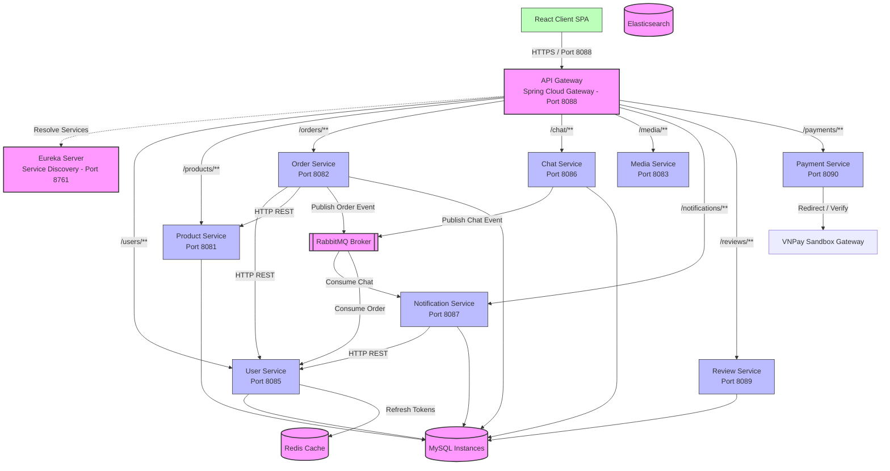

# 02. Kiến trúc hệ thống

Tài liệu này chi tiết hóa các mẫu kiến trúc, giao thức giao tiếp, cơ chế xác thực và cấu hình hạ tầng công nghệ của nền tảng thương mại điện tử đồ cũ **ĐồCũ**.

---

## 1. Sơ đồ kiến trúc tổng quan (High-Level Architecture)

Hệ thống được xây dựng theo **Mẫu kiến trúc Microservices**. Mỗi nghiệp vụ cốt lõi được đóng gói trong một dịch vụ độc lập, tuân thủ mô hình **Database-per-Service** (Mỗi dịch vụ một cơ sở dữ liệu riêng) để đảm bảo tính độc lập tối đa.



---

## 2. Các thành phần kiến trúc cốt lõi

### 2.1 React Frontend
* **Công nghệ**: React 18, Vite, Tailwind CSS, Axios, React Router.
* **Vai trò**: Ứng dụng trang đơn (SPA) cung cấp giao diện người dùng.
* **Cơ chế**: Giao tiếp độc quyền với API Gateway. Sử dụng Axios Interceptors để đính kèm token JWT vào HTTP headers cho các yêu cầu cần xác thực và thực hiện cơ chế polling để lấy cập nhật.

### 2.2 API Gateway
* **Công nghệ**: Spring Cloud Gateway, Spring WebFlux (máy chủ reactive Netty).
* **Vai trò**: Điểm truy cập duy nhất cho Client.
* **Nhiệm vụ**:
  1. **Định tuyến (Routing)**: Chuyển tiếp các yêu cầu public (ví dụ: `/products/**`) đến các thực thể dịch vụ nội bộ thông qua Eureka Service Registry (`lb://product-service`).
  2. **Bảo mật tập trung (Centralized Authentication)**: Chặn các yêu cầu bảo mật, xác thực chữ ký JWT và ngăn chặn các yêu cầu không hợp lệ đi sâu vào hệ thống.
  3. **Truyền tải ngữ cảnh (Context Injection)**: Giải mã claims từ token JWT và chèn thông tin người dùng (`X-User-Id` và `X-User-Role`) dưới dạng HTTP headers chuyển tiếp cho các dịch vụ downstream.

### 2.3 Service Registry (Eureka Server)
* **Công nghệ**: Netflix Eureka Server.
* **Vai trò**: Danh bạ dịch vụ động cho toàn bộ hệ thống microservices.
* **Nhiệm vụ**: Các microservice khi khởi động sẽ tự động đăng ký địa chỉ IP và cổng của mình lên Eureka. API Gateway và các dịch vụ khác truy vấn Eureka để gọi dịch vụ qua tên ảo (ví dụ: `http://user-service`) thay vì dùng IP cố định.

---

## 3. Giao thức giao tiếp (Communication Patterns)

Hệ thống kết hợp cả giao thức đồng bộ (REST) cho các yêu cầu truy vấn trực tiếp và bất đồng bộ (Message Broker) để truyền tải sự kiện.

### 3.1 Giao tiếp đồng bộ (HTTP/REST)
Sử dụng khi một dịch vụ cần dữ liệu phản hồi ngay lập tức từ một dịch vụ khác để hoàn thành nghiệp vụ.
* **Ví dụ**:
  1. Khi tạo đơn hàng, `order-service` gọi sang `user-service` qua địa chỉ `http://user-service/users/{userId}` để xác thực tài khoản mua hàng.
  2. Đồng thời, `order-service` gọi `product-service` qua `http://product-service/products/{productId}` để lấy giá sản phẩm hiện tại.
  3. Khi có tin nhắn mới, `notification-service` gọi `user-service` để lấy tên hiển thị của người gửi nhằm hiển thị thông báo thân thiện.
* **Triển khai**: Sử dụng `RestTemplate` của Spring kết hợp với bộ định tuyến cân bằng tải của Eureka.

### 3.2 Giao tiếp bất đồng bộ (Event-Driven Broker)
Sử dụng cho các quy trình chạy ngầm, không chặn (non-blocking) và để đảm bảo tính nhất quán cuối cùng (eventual consistency).
* **Công nghệ**: **RabbitMQ** (giao thức AMQP).
* **Luồng xử lý**:
  1. **Sự kiện tạo đơn hàng**: Khi `order-service` lưu thành công một đơn hàng mới, nó gửi một chuỗi thông báo vào hàng đợi `order_queue`. `user-service` lắng nghe hàng đợi này để xử lý ngầm (mô phỏng việc gửi email xác nhận cho khách hàng).
  2. **Sự kiện tin nhắn chat**: Khi người dùng gửi tin nhắn, `chat-service` đẩy sự kiện chứa thông tin định dạng (`CHAT|senderId|receiverId|roomId|content`) lên exchange `chat.exchange` với routing key `chat.notification.new`. Dịch vụ `notification-service` lắng nghe từ hàng đợi liên kết để xử lý và lưu thông báo.

---

## 4. Quy trình bảo mật & xác thực (Security Flow)

Hệ thống triển khai mô hình **Xác thực tại Biên (Edge Authentication)** tại API Gateway kết hợp với **Phục hồi ngữ cảnh Downstream**.

### 4.1 Vòng đời của Token
```
[Client]                [Gateway]              [User Service]           [Redis]
   |                        |                         |                    |
   |---- 1. Đăng nhập ------------------------------->|                    |
   |                         (Xác thực mật khẩu)      |                    |
   |<--- 2. Trả JWT + Refresh Token ------------------|                    |
   |                                                  |-- 3. Lưu RT ------>|
   |                                                                       |
   |---- 4. Gửi request kèm JWT ->|                                        |
   |                        (Xác thực JWT)                                 |
   |                        (Nhúng Headers)                                |
   |                        |---- 5. Chuyển tiếp downstream ------------->|
```

1. **Đăng nhập**: Người dùng gửi email/mật khẩu tới endpoint `/auth/login` (endpoint này được Gateway bỏ qua bộ lọc xác thực). `user-service` kiểm tra tài khoản và xác thực mật khẩu đã mã hóa bằng BCrypt.
2. **Tạo Token**: Nếu thông tin đúng, `user-service` tạo ra:
   * **Access Token (JWT)**: Hết hạn sau 24 giờ. Chứa thông tin `userId`, `email`, và `role`.
   * **Refresh Token (RT)**: Thời hạn dài hơn, được lưu trữ trong **Redis** với TTL là 7 ngày để quản lý thu hồi/xoay vòng phiên đăng nhập.
3. **Chặn tại Gateway**: Với các request tiếp theo, client đính kèm JWT vào header `Authorization: Bearer <token>`.
4. **Xác thực tại Gateway**: Gateway sử dụng khóa bí mật chung (`jwt.secret`) để kiểm tra tính hợp lệ và thời hạn của chữ ký JWT.
5. **Truyền tải thông tin**:
   * Gateway nhúng các header `X-User-Id` và `X-User-Role` vào request chuyển tiếp downstream.
   * Các dịch vụ phía sau (như `order-service`, `chat-service`) cấu hình bộ lọc `JwtAuthenticationFilter`. Bộ lọc này ưu tiên đọc các header `X-User-*` để thiết lập nhanh Security Context cho Spring. Nếu không có, bộ lọc sẽ tự giải mã từ header `Authorization` (tiện lợi cho việc test API trực tiếp).
6. **Làm mới phiên (Refresh)**: Khi JWT hết hạn, client gọi `/auth/refresh?refreshToken=...`. Dịch vụ `user-service` kiểm tra tính hợp lệ của Refresh Token trong Redis rồi cấp lại JWT mới.
7. **Đăng xuất**: Khi người dùng đăng xuất, `user-service` xóa khóa Refresh Token khỏi Redis, lập tức vô hiệu hóa phiên làm việc đó.

---

## 5. Lưu trữ & Bộ nhớ đệm

* **Dữ liệu nghiệp vụ (MySQL)**: Mỗi dịch vụ sở hữu một schema MySQL riêng biệt (như `product_db`, `chat_db`). Việc này tránh xung đột khóa bảng chéo domain và tăng tính cô lập lỗi (một DB lỗi không làm sập toàn bộ hệ thống).
* **Bộ nhớ đệm (Redis)**: Được sử dụng duy nhất tại `user-service` để lưu trữ Refresh Tokens. Redis đảm bảo tốc độ đọc/ghi cực nhanh và tự động hủy khóa khi hết hạn TTL.
* **Lưu trữ tệp tin (File Storage)**: Dịch vụ `media-service` đóng vai trò là một máy chủ tài nguyên tĩnh. Ảnh tải lên được lưu trực tiếp trên ổ đĩa cứng máy chủ (`./uploads`) và phân phối qua endpoint công khai `/media/images/{fileName}`.
