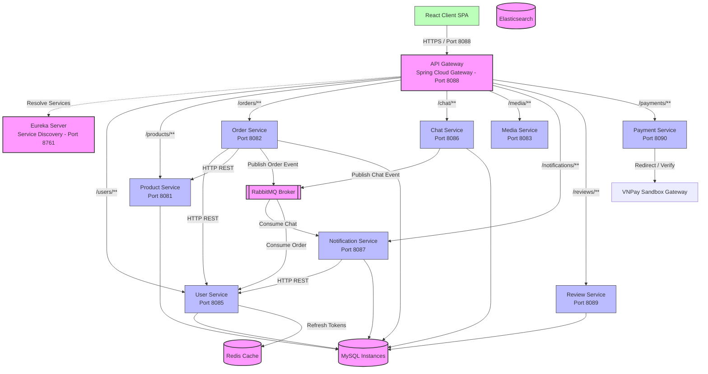

# 02. System Architecture

This document details the architectural patterns, communication protocols, authentication mechanisms, and technology stack configuration of the **ĐồCũ** secondhand e-commerce platform.

---

## 1. High-Level Architecture Diagram

The system is constructed using the **Microservices Architecture Pattern**. Each business capability is encapsulated within an independent service, adhering to the **Database-per-Service** design pattern to ensure loose coupling.



---

## 2. Core Architectural Components

### 2.1 React Frontend
* **Technology**: React 18, Vite, Tailwind CSS, Axios, React Router.
* **Role**: Single Page Application (SPA) serving as the main user interface.
* **Mechanism**: Interacts exclusively with the API Gateway. Uses Axios interceptors to inject JWT tokens into HTTP headers for authenticated requests and polls backend endpoints for updates.

### 2.2 API Gateway
* **Technology**: Spring Cloud Gateway, Spring WebFlux (Reactive Netty server).
* **Role**: Single Entry Point for clients.
* **Responsibilities**:
  1. **Route Mapping**: Dynamic routing to microservices mapped through the Eureka Service Registry.
  2. **Centralized Authentication**: Intercepts secure requests, verifies the JWT signature, and prevents unauthenticated requests from passing downstream.
  3. **Context Injection**: Mutates incoming requests by decoding claims and injecting user identifiers (`X-User-Id` and `X-User-Role`) as downstream headers.

### 2.3 Service Registry (Eureka Server)
* **Technology**: Netflix Eureka Server.
* **Role**: Directory service for microservices.
* **Responsibilities**: Downstream services register their instance IPs and ports dynamically. The Gateway and other services use this registry to load-balance internal communications using service virtual names (e.g. `http://user-service`).

---

## 3. Communication Patterns

The system implements a hybrid communication architecture, combining synchronous REST protocols for queries and asynchronous messaging for event propagation.

### 3.1 Synchronous Communication (HTTP/REST)
Used when a service requires immediate data from another service to complete its transaction.
* **Example**:
  1. When creating an order, `order-service` calls `user-service` at `http://user-service/users/{userId}` to verify the buyer's status.
  2. Next, `order-service` calls `product-service` at `http://product-service/products/{productId}` to fetch price data.
  3. When generating notifications, `notification-service` calls `user-service` to retrieve the sender's full name.
* **Implementation**: Managed using Spring's `RestTemplate` coupled with Eureka for service discovery.

### 3.2 Asynchronous Communication (Event-Driven Broker)
Used for non-blocking operations, cross-service notifications, and eventual consistency.
* **Technology**: **RabbitMQ** (using the AMQP protocol).
* **Workflows**:
  1. **Order Creation Event**: When `order-service` successfully persists a new order, it publishes a confirmation string to the `order_queue` queue. The `user-service` listens to this queue to process background operations (e.g., simulating sending confirmation emails).
  2. **Chat Message Event**: When a user sends a message, `chat-service` publishes a structured event (`CHAT|senderId|receiverId|roomId|content`) to `chat.exchange` with the routing key `chat.notification.new`. The `notification-service` listens to `chat_queue` (bound to this exchange) to process and persist notifications.

---

## 4. Security & Authentication Flow

The system implements **Edge Authentication** at the API Gateway level, combined with **Downstream Context Retrieval**.

### 4.1 Token Lifecycle
```
[Client]                [Gateway]              [User Service]           [Redis]
   |                        |                         |                    |
   |---- 1. Credentials ----------------------------->|                    |
   |                         (Verify Password)        |                    |
   |<--- 2. JWT + Refresh Token ----------------------|                    |
   |                                                  |-- 3. Save RT ----->|
   |                                                                       |
   |---- 4. Request with JWT ---->|                                        |
   |                        (Validate JWT)                                 |
   |                        (Inject Headers)                               |
   |                        |---- 5. Route to Downstream ----------------->|
```

1. **Authentication**: The user logs in via `/auth/login` (bypassing security filters at the Gateway). `user-service` verifies the hashed password using BCrypt.
2. **Token Generation**: On success, `user-service` generates:
   * **Access Token (JWT)**: Expiring in 24 hours. Contains `userId`, `email`, and `role` claims.
   * **Refresh Token (RT)**: Long-lived token stored in **Redis** with a 7-day expiration time.
3. **Gateway Interception**: For subsequent requests, the client attaches the JWT in the `Authorization: Bearer <token>` header.
4. **Gateway Verification**: The Gateway checks the signature using a shared HMAC-SHA256 key (`jwt.secret`).
5. **Context Propagation**:
   * The Gateway injects the headers `X-User-Id` and `X-User-Role` into the downstream request.
   * Secure downstream services (e.g. `order-service`, `chat-service`) run a local `JwtAuthenticationFilter`. If the Gateway headers are present, they instantiate the Spring Security Context immediately. If they are absent, they fallback to checking the `Authorization` header directly (facilitating testing).
6. **Token Refresh**: When the JWT expires, the client calls `/auth/refresh?refreshToken=...`. `user-service` verifies the refresh token against Redis and issues a new JWT.
7. **Logout**: When logging out, `user-service` deletes the Refresh Token from Redis, effectively invalidating the session.

---

## 5. Caching & Persistence

* **Transactional Data (MySQL)**: Each service has its own dedicated MySQL database schema (e.g., `product_db` for products, `chat_db` for chat history). This prevents database locks across domains and ensures that one database crash does not halt the entire system.
* **Caching & Session Storage (Redis)**: Used in the `user-service` exclusively to store Refresh Tokens. The choice of Redis ensures high-speed reads/writes and automated TTL-based token expiration.
* **File Uploads (Local Storage)**: The `media-service` acts as a static content server. Uploaded files are stored on the local system path (`./uploads`) and retrieved directly via GET requests to `/media/images/{fileName}` (which are set as public endpoints in the Gateway).
