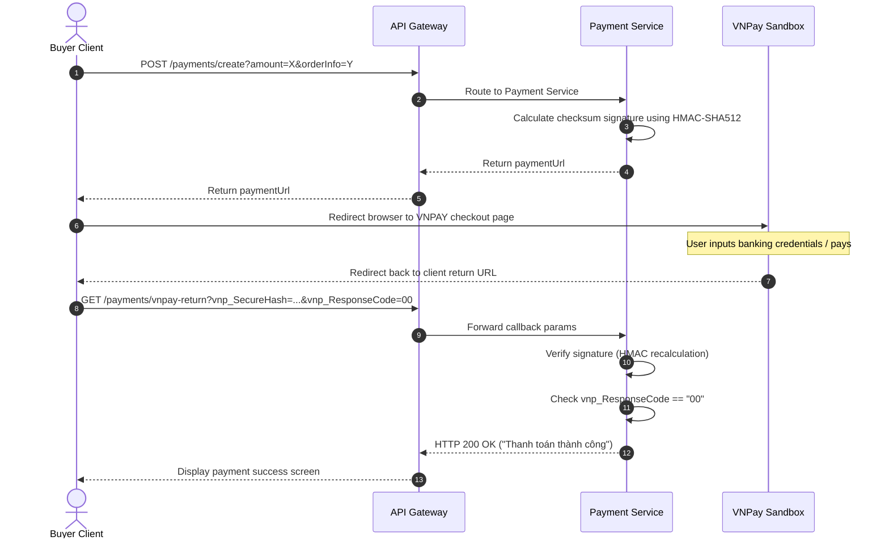
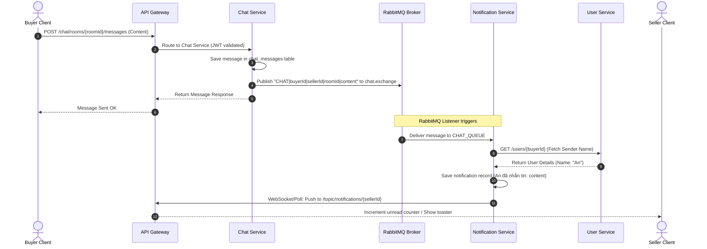

# 05. Workflow Documentation

This document traces the end-to-end execution flows for critical operations in the **ĐồCũ** secondhand e-commerce platform.

---

## 1. User Registration & Login

### Description
Creates a new user profile or verifies credentials to initiate an authenticated session.

### Step-by-Step Process
1. The user inputs registration/login credentials in the frontend.
2. The request is sent to `api-gateway` which forwards it bypass-filtered to `user-service`.
3. For registration:
   * `user-service` validates email uniqueness.
   * Hashes the password using BCrypt.
   * Saves the `User` record to `user_db`.
4. For login:
   * `user-service` retrieves the user by email and validates the password.
5. Generates a JWT (24-hour expiration) and a Refresh Token (7-day expiration).
6. Saves the Refresh Token into Redis (`RT:<email>`).
7. Returns both tokens to the frontend, which stores the JWT in `localStorage` for future requests.

### Sequence Diagram
```mermaid
sequenceDiagram
    autonumber
    actor User as User Client
    participant GW as API Gateway
    participant US as User Service
    participant Redis as Redis Cache
    database DB as MySQL (user_db)

    User->>GW: POST /auth/login
    GW->>US: Forward POST /auth/login
    US->>DB: Query User by Email
    DB-->>US: Return User Entity (Hashed Password)
    US->>US: Validate Password (BCrypt check)
    US->>Redis: Store Refresh Token (RT:email, 7 days TTL)
    US-->>GW: Return Access Token (JWT) & Refresh Token
    GW-->>User: Return Tokens (Save to LocalStorage)
```

---

## 2. Product Posting & Admin Approval

### Description
A seller lists a secondhand item, which must pass moderation by an administrator before appearing publicly.

### Step-by-Step Process
1. The seller uploads images. The images are stored via `media-service`, which returns relative URLs.
2. The seller submits the product creation request. The Gateway attaches `X-User-Id` to identify the seller.
3. `product-service` saves the product with `isApproved = true` (development default, or `false` if strict approval is turned on) and status `"AVAILABLE"`.
4. An Administrator opens the Admin Panel and calls `PUT /admin/products/{id}/approve?approved=true`.
5. `product-service` updates `is_approved = true` in `product_db`, making the item public.

### Sequence Diagram
```mermaid
sequenceDiagram
    autonumber
    actor Seller as Seller Client
    participant GW as API Gateway
    participant MS as Media Service
    participant PS as Product Service
    database DB as MySQL (product_db)
    actor Admin as Admin Client

    %% Image Upload
    Seller->>GW: POST /media/upload (Form Data)
    GW->>MS: Route to Media Service
    MS->>MS: Save images locally to ./uploads
    MS-->>GW: Return relative URLs (/media/images/xxx.png)
    GW-->>Seller: Image URL list

    %% Product Creation
    Seller->>GW: POST /products (Product Details + Image URLs)
    Note over GW: Validates JWT, injects X-User-Id
    GW->>PS: Forward with X-User-Id
    PS->>DB: Save Product (approved=true/false, status=AVAILABLE)
    DB-->>PS: Return Product Entity
    PS-->>GW: Return saved Product
    GW-->>Seller: Product posted successfully

    %% Admin Moderation
    Admin->>GW: PUT /admin/products/{id}/approve?approved=true
    GW->>PS: Forward Admin Request
    PS->>DB: Update is_approved = true
    DB-->>PS: Saved
    PS-->>GW: Success Response
    GW-->>Admin: Listing approved
```

---

## 3. Product Search & Detail

### Description
A visitor searches the catalog with filters and views an item's details, including seller ratings.

### Step-by-Step Process
1. The user requests a search with parameters (keyword, category, location, min/max price).
2. The Gateway maps the GET request to `product-service`. Since it is public, the Gateway bypasses security verification.
3. `product-service` compiles the queries into a JPA Specification and fetches matching records from `product_db`.
4. When clicking a product, the frontend queries `GET /products/{id}` to display metadata, images, and dynamic attributes.
5. In parallel, the frontend queries:
   * `GET /users/{sellerId}` to show seller name and avatar.
   * `GET /reviews/user/{sellerId}/rating` to fetch the seller's average score.
   * `GET /reviews/user/{sellerId}` to list comments and reviews.

---

## 4. Order Placement

### Description
Purchasing an item initiates cross-service verification and publishes order confirmation details asynchronously.

### Step-by-Step Process
1. The buyer clicks checkout. The frontend posts order details to `/orders` (passing `userId` and items list).
2. `order-service` intercept-authenticates the request.
3. `order-service` calls `user-service` (`GET /users/{userId}`) to verify the buyer exists.
4. `order-service` loops through each item, calling `product-service` (`GET /products/{productId}`) to fetch product name and verify price.
5. Calculates total price, saves the order and order items in `order_db` (`orders` and `order_items` tables).
6. Publishes a string confirmation to RabbitMQ queue `order_queue`.
7. `user-service` consumes the message from `order_queue` and logs it, representing background actions like sending confirmation emails.

### Sequence Diagram
```mermaid
sequenceDiagram
    autonumber
    actor Buyer as Buyer Client
    participant GW as API Gateway
    participant OS as Order Service
    participant US as User Service
    participant PS as Product Service
    database DB as MySQL (order_db)
    participant MQ as RabbitMQ Broker

    Buyer->>GW: POST /orders (userId, items list)
    GW->>OS: Route to Order Service (checks JWT)
    
    OS->>US: GET /users/{userId} (Verify User)
    US-->>OS: User details (name, email)
    
    loop for each item
        OS->>PS: GET /products/{productId} (Fetch Details)
        PS-->>OS: Product details (name, price)
    end
    
    OS->>OS: Calculate total amount
    OS->>DB: Save Order & OrderItems
    DB-->>OS: Saved Order Entity
    
    OS->>MQ: Send confirmation to order_queue
    Note over MQ,US: User Service consumes event & processes background email
    
    OS-->>GW: Return Order Details
    GW-->>Buyer: Order Confirmation Response
```

---

## 5. Payment Workflow (VNPay Integration)

### Description
A user pays for an order using an online banking gateway, which returns cryptographic feedback to update the payment status.

### Step-by-Step Process
1. The frontend requests payment creation by calling `POST /payments/create?amount=...&orderInfo=...`.
2. `payment-service` calculates checkout properties and appends the merchant identifier (`vnp_TmnCode`).
3. Sorts all parameters and hashes them using HMAC-SHA512 with a secret key (`vnp_HashSecret`) to create the signature (`vnp_SecureHash`).
4. Returns the compiled URL to the client. The client is redirected to the VNPay Sandbox page.
5. The user completes payment on VNPay. VNPay redirects the user back to the frontend Return URL (`/payments/vnpay-return`).
6. `payment-service` reads callback query parameters, strips the signature, hashes parameters again, and compares hashes.
7. If signatures match and response code is `"00"`, the payment is verified as successful.

### Sequence Diagram


---

## 6. Real-Time Chat & Offline Notifications

### Description
Users send messages in real-time, which prompts background notifications to offline users.

### Step-by-Step Process
1. Sender posts a message to `/chat/rooms/{roomId}/messages`.
2. `chat-service` saves the message in `chat_db`.
3. `chat-service` sends the message to the active WebSocket channel (`/topic/chat/{roomId}`) if the receiver is online.
4. `chat-service` generates a notification packet: `CHAT|senderId|receiverId|roomId|content` and publishes it to `chat.exchange` in RabbitMQ.
5. `notification-service` consumes this packet from `chat_queue`.
6. `notification-service` queries `user-service` (`GET /users/{senderId}`) synchronously via REST to retrieve the sender's full name.
7. Saves a new notification record (`isRead = false`) to `notification_db`.
8. Emits the notification to `/topic/notifications/{receiverId}` via WebSocket. The client's navbar unread indicator increments dynamically.

### Sequence Diagram


---

## 7. Architectural Gaps & Limitations

* **No Stock Deduction**: The `order-service` verifies product prices in `product-service`, but it does not deduct inventory (`stock` count in `product-service`) upon order placement.
* **No Payment-Order Linking**: When a VNPay transaction completes successfully in `payment-service`, it logs the status but does not notify `order-service` via API or messaging to update the order state (e.g. from `UNPAID` to `PAID`).
* **Frontend Polling Fallback**: The React client uses `setInterval` (polling at 3s and 5s intervals) to retrieve messages and notifications, ignoring the backend's active STOMP WebSocket configurations.
