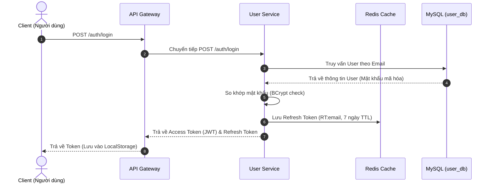
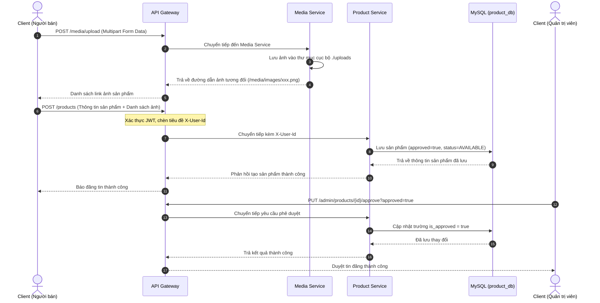
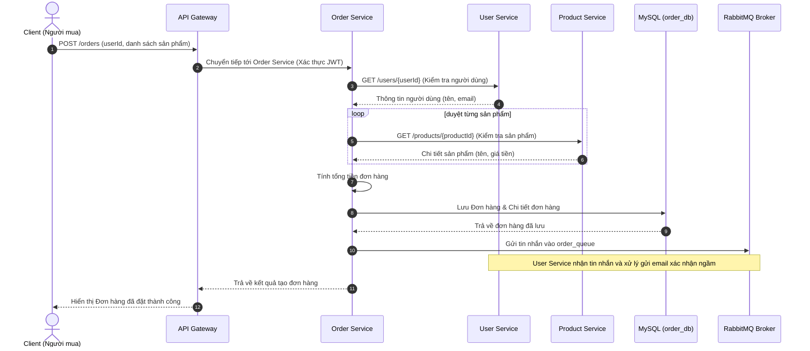
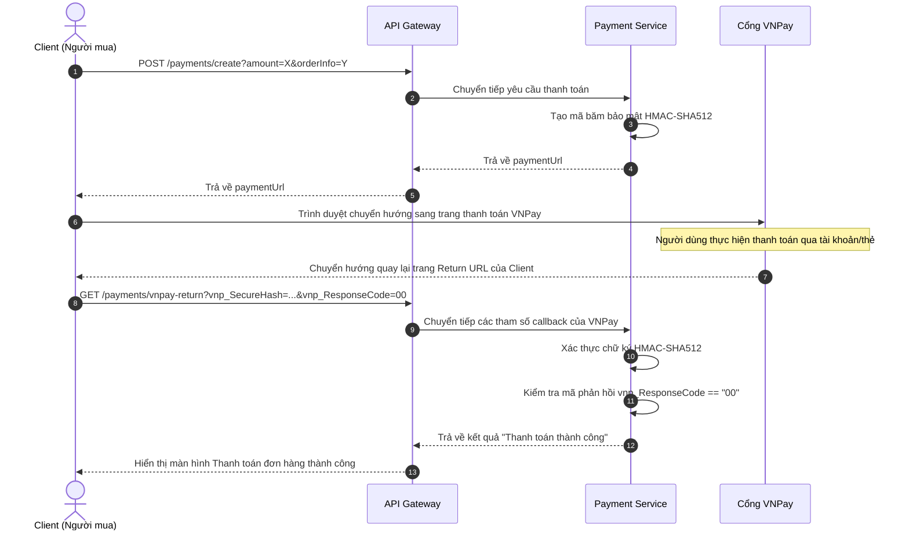
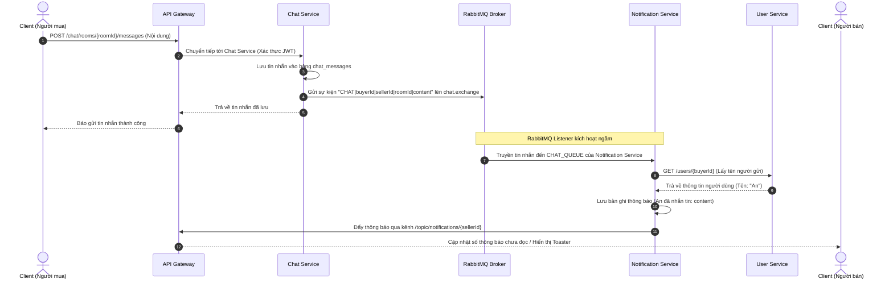

# 05. Tài liệu quy trình nghiệp vụ (Workflow)

Tài liệu này theo dõi các luồng xử lý đầu cuối (end-to-end) của các nghiệp vụ quan trọng trong nền tảng chợ đồ cũ **ĐồCũ**.

---

## 1. Luồng đăng ký & đăng nhập

### Mô tả
Tạo tài khoản mới hoặc xác thực thông tin đăng nhập của thành viên để bắt đầu một phiên làm việc có bảo mật.

### Các bước xử lý
1. Người dùng nhập thông tin đăng ký/đăng nhập trên giao diện frontend.
2. Yêu cầu được gửi đến `api-gateway`. Gateway kiểm tra và chuyển tiếp không xác thực đến `user-service`.
3. Đối với luồng đăng ký:
   * `user-service` kiểm tra tính duy nhất của email trong database.
   * Mã hóa mật khẩu bằng thư viện BCrypt.
   * Lưu bản ghi `User` mới vào cơ sở dữ liệu `user_db`.
4. Đối với luồng đăng nhập:
   * `user-service` tìm người dùng theo email và thực hiện so khớp mật khẩu mã hóa.
5. Cấp phát cặp token: Access Token (JWT hết hạn sau 24 giờ) và Refresh Token (hết hạn sau 7 ngày).
6. Lưu Refresh Token vào bộ nhớ đệm Redis với khóa (`RT:<email>`).
7. Trả lại thông tin hai token về cho Client. Giao diện frontend lưu JWT vào `localStorage` để đính kèm cho các request tiếp theo.

### Sơ đồ tuần tự (Sequence Diagram)

---

## 2. Luồng đăng tin & Phê duyệt sản phẩm

### Mô tả
Người bán đăng sản phẩm cũ lên hệ thống, tin đăng này có thể cần đi qua bộ lọc kiểm duyệt của Quản trị viên trước khi hiển thị công khai.

### Các bước xử lý
1. Người bán chọn tải lên hình ảnh sản phẩm. Các ảnh này được gửi đến `media-service` để lưu trữ và nhận lại các đường dẫn tương đối.
2. Người bán điền thông tin chi tiết sản phẩm và gửi request. Gateway tự động đính kèm header `X-User-Id` để định danh người bán.
3. Dịch vụ `product-service` lưu trữ thông tin sản phẩm vào database `product_db` với trạng thái mặc định ban đầu là `AVAILABLE` và cờ phê duyệt `isApproved = true` (được cấu hình mặc định tự động duyệt trong môi trường thử nghiệm, hoặc `false` nếu yêu cầu duyệt nghiêm ngặt).
4. Quản trị viên có thể vào trang admin và phê duyệt sản phẩm thủ công bằng cách gọi API `PUT /admin/products/{id}/approve?approved=true`.
5. Dịch vụ `product-service` cập nhật cờ `is_approved = true` giúp sản phẩm xuất hiện công khai trên giao diện tìm kiếm.

### Sơ đồ tuần tự (Sequence Diagram)

---

## 3. Luồng tìm kiếm & xem chi tiết sản phẩm

### Mô tả
Người mua tìm kiếm danh mục sản phẩm theo bộ lọc và nhấp chọn xem chi tiết một tin đăng cụ thể bao gồm cả uy tín của người bán.

### Các bước xử lý
1. Người mua thực hiện tìm kiếm bằng cách truyền các tham số lọc (từ khóa, danh mục, khoảng giá, vị trí).
2. API Gateway chuyển tiếp yêu cầu đến `product-service`. Do đây là hành vi xem công khai, Gateway cho phép đi qua không cần token.
3. Dịch vụ `product-service` tạo truy vấn SQL động dựa trên Specification và trả về danh sách sản phẩm.
4. Khi người mua nhấp xem chi tiết một sản phẩm, frontend gọi API `GET /products/{id}` để hiển thị ảnh, thông số attributes và mô tả.
5. Đồng thời, frontend chạy các request song song:
   * `GET /users/{sellerId}` để hiển thị tên và avatar của người bán.
   * `GET /reviews/user/{sellerId}/rating` để lấy điểm đánh giá trung bình của người bán.
   * `GET /reviews/user/{sellerId}` để lấy danh sách các nhận xét từ những người mua trước.

---

## 4. Luồng đặt hàng (Order Placement)

### Mô tả
Người dùng thực hiện mua sản phẩm, kích hoạt các cuộc gọi đồng bộ để kiểm tra chéo thông tin và bắn sự kiện bất đồng bộ khi hoàn thành.

### Các bước xử lý
1. Người mua nhấp mua sản phẩm. Frontend gửi yêu cầu đặt hàng đến `/orders` (chứa `userId` và danh sách sản phẩm kèm số lượng).
2. Dịch vụ `order-service` tiếp nhận yêu cầu và xác thực tài khoản qua JWT.
3. `order-service` thực hiện cuộc gọi REST đồng bộ tới `user-service` (`GET /users/{userId}`) để đảm bảo tài khoản mua hàng tồn tại và hoạt động hợp lệ.
4. `order-service` duyệt qua từng sản phẩm trong đơn, gọi đồng bộ tới `product-service` (`GET /products/{productId}`) để lấy tên sản phẩm và kiểm tra giá bán thực tế.
5. Hệ thống tính toán tổng số tiền, lưu thông tin vào các bảng `orders` và `order_items` trong database `order_db`.
6. Bắn một tin nhắn văn bản thông báo đặt hàng thành công vào hàng đợi RabbitMQ `order_queue`.
7. Dịch vụ `user-service` lắng nghe từ hàng đợi, nhận thông báo đặt hàng và mô phỏng tác vụ gửi email thông báo xác nhận đơn hàng trong nền.

### Sơ đồ tuần tự (Sequence Diagram)

---

## 5. Luồng thanh toán trực tuyến (VNPay Integration)

### Mô tả
Tạo liên kết để khách hàng thanh toán qua ngân hàng, nhận kết quả mã hóa từ cổng thanh toán để xác nhận giao dịch.

### Các bước xử lý
1. Người mua nhấn chọn thanh toán, frontend gửi yêu cầu tới `POST /payments/create?amount=...&orderInfo=...`.
2. Dịch vụ `payment-service` tiếp nhận, lấy cấu hình merchant (`vnp_TmnCode`).
3. Sắp xếp các tham số thanh toán theo thứ tự bảng chữ cái, sử dụng khóa bí mật (`vnp_HashSecret`) để tính mã băm HMAC-SHA512 (`vnp_SecureHash`).
4. Trả URL thanh toán hoàn chỉnh về cho client. Frontend chuyển hướng người dùng sang trang thanh toán của VNPay.
5. Người dùng nhập thẻ ngân hàng và thanh toán thành công. VNPay chuyển hướng người dùng quay lại đường dẫn Return URL (`/payments/vnpay-return`).
6. Dịch vụ `payment-service` tiếp nhận các tham số phản hồi, loại bỏ chữ ký cũ, tiến hành băm lại dữ liệu bằng khóa bí mật và so sánh đối chiếu chữ ký.
7. Nếu chữ ký trùng khớp và mã phản hồi `vnp_ResponseCode == "00"`, giao dịch được xác thực là thanh toán thành công.

### Sơ đồ tuần tự (Sequence Diagram)

---

## 6. Luồng chat trực tiếp & thông báo ngoại tuyến

### Mô tả
Hai người dùng trò chuyện thương lượng trực tiếp, hệ thống kích hoạt thông báo ngầm nếu đối phương không online trong phòng chat.

### Các bước xử lý
1. Người gửi nhập nội dung và bấm gửi tin nhắn trong giao diện chat.
2. Dịch vụ `chat-service` lưu tin nhắn mới vào bảng `chat_messages` trong database `chat_db`.
3. `chat-service` đẩy trực tiếp tin nhắn qua kênh WebSocket `/topic/chat/{roomId}` để hiển thị tức thời nếu đối phương đang mở phòng chat.
4. Đồng thời, `chat-service` tạo chuỗi sự kiện `CHAT|senderId|receiverId|roomId|content` và đẩy vào exchange `chat.exchange` của RabbitMQ.
5. Dịch vụ `notification-service` lắng nghe từ hàng đợi `chat_queue` và tiêu thụ tin nhắn này.
6. `notification-service` thực hiện cuộc gọi REST đồng bộ tới `user-service` để lấy tên đầy đủ của người gửi.
7. Tạo bản ghi thông báo mới với cờ `isRead = false` trong database `notification_db`.
8. Đẩy cảnh báo tin nhắn mới qua kênh WebSocket `/topic/notifications/{receiverId}` để hiển thị thông báo góc màn hình và cập nhật số lượng thông báo chưa đọc trên thanh điều hướng của người nhận.

### Sơ đồ tuần tự (Sequence Diagram)

---

## 7. Các hạn chế và thiếu sót về mặt kiến trúc hiện tại

* **Chưa có luồng trừ kho**: Khi tạo đơn hàng thành công trong `order-service`, hệ thống chỉ kiểm tra thông tin và lưu đơn chứ chưa thực hiện trừ đi số lượng tồn kho (`stock` của sản phẩm tại `product-service`).
* **Chưa liên kết trạng thái thanh toán**: Khi thanh toán thành công qua VNPay tại `payment-service`, hệ thống chỉ ghi nhận kết quả thành công và ghi log chứ chưa thực hiện gọi API hay bắn tin nhắn để cập nhật trạng thái đơn hàng của `order-service` từ "Chưa thanh toán" sang "Đã thanh toán".
* **Sử dụng cơ chế Polling thay vì WebSocket hoàn chỉnh ở Frontend**: Mặc dù backend đã cấu hình đầy đủ máy chủ WebSocket STOMP cho tin nhắn chat và thông báo, ứng dụng React Frontend hiện tại vẫn sử dụng bộ định thời `setInterval` (3 giây để lấy tin nhắn, 5 giây để lấy thông báo) để lấy dữ liệu từ các API REST thường.
