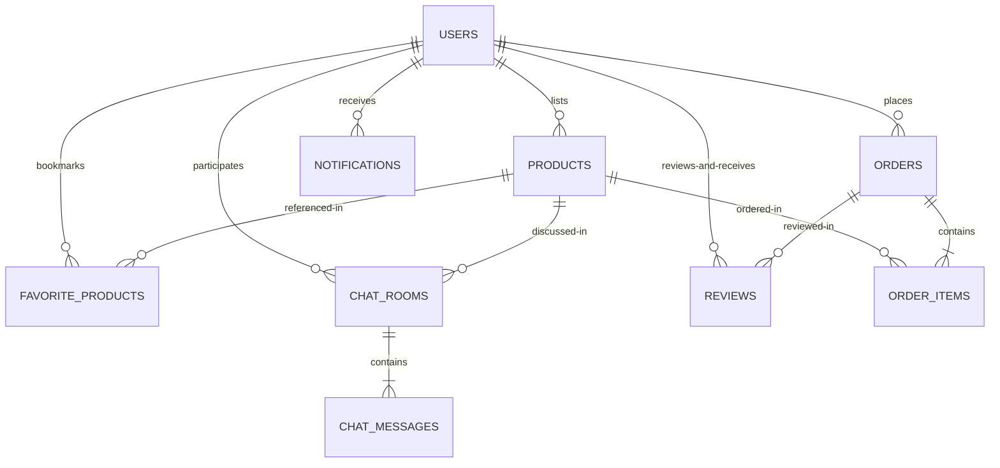

# 06. Tài liệu cơ sở dữ liệu

Nền tảng chợ đồ cũ **ĐồCũ** áp dụng mô hình **Database-per-Service** (Mỗi dịch vụ một cơ sở dữ liệu riêng) nhằm phân tách giới hạn giao dịch và ngăn ngừa xung đột dữ liệu chéo giữa các miền nghiệp vụ.

---

## 1. Sơ đồ thực thể liên kết logic (Conceptual ER Diagram)

Mặc dù các cơ sở dữ liệu được tách biệt vật lý trong các schema MySQL khác nhau, chúng vẫn liên kết với nhau về mặt logic thông qua các khóa định danh như (`user_id`, `product_id`, `order_id`).

---

## 2. Cấu trúc bảng của từng cơ sở dữ liệu

### 2.1 Cơ sở dữ liệu người dùng (`user_db`)

Quản lý thành viên, vai trò, mật khẩu và trang cá nhân.

#### Bảng: `users`
| Cột | Kiểu dữ liệu | Ràng buộc | Mô tả |
| --- | --- | --- | --- |
| `id` | `BIGINT` | **PK**, Auto Increment | Khóa chính tự tăng, định danh duy nhất người dùng. |
| `name` | `VARCHAR(255)` | `NOT NULL` | Tên hiển thị của người dùng. |
| `email` | `VARCHAR(255)` | `UNIQUE`, `NOT NULL` | Địa chỉ email dùng làm tài khoản đăng nhập. |
| `password` | `VARCHAR(255)` | `NOT NULL` | Mật khẩu đã được mã hóa bằng thuật toán BCrypt. |
| `phone` | `VARCHAR(255)` | | Số điện thoại liên hệ. |
| `avatar_url` | `VARCHAR(255)` | | Đường dẫn ảnh đại diện của người dùng. |
| `role` | `VARCHAR(255)` | `NOT NULL`, Mặc định: `'USER'` | Vai trò truy cập: `USER`, `ADMIN`. |
| `created_at` | `DATETIME` | | Thời gian đăng ký tài khoản. |

---

### 2.2 Cơ sở dữ liệu sản phẩm (`product_db`)

Quản lý danh mục sản phẩm, danh sách sản phẩm đăng bán và danh sách yêu thích.

#### Bảng: `products`
| Cột | Kiểu dữ liệu | Ràng buộc | Mô tả |
| --- | --- | --- | --- |
| `id` | `BIGINT` | **PK**, Auto Increment | Khóa chính tự tăng, định danh sản phẩm. |
| `name` | `VARCHAR(255)` | | Tiêu đề tin đăng bán sản phẩm. |
| `description` | `VARCHAR(255)` | | Mô tả chi tiết sản phẩm. |
| `price` | `DOUBLE` | | Giá bán mong muốn (đơn vị VND). |
| `stock` | `INT` | | Số lượng tồn kho có sẵn. |
| `category` | `VARCHAR(255)` | | Danh mục sản phẩm (ví dụ: Nội thất, Điện tử). |
| `location` | `VARCHAR(255)` | | Vị trí địa lý đăng bán. |
| `item_condition`| `VARCHAR(255)` | | Tình trạng sản phẩm: `NEW` (mới), `USED` (đã sử dụng). |
| `status` | `VARCHAR(255)` | | Trạng thái tin đăng: `AVAILABLE` (còn hàng), `SOLD` (đã bán). |
| `seller_id` | `BIGINT` | `NOT NULL` | Khóa liên kết logic trỏ đến `users.id` trong `user_db`. |
| `is_approved` | `TINYINT(1)` | `NOT NULL`, Mặc định: `1` | Cờ phê duyệt nội dung của admin. |
| `latitude` | `DOUBLE` | | Tọa độ vĩ độ GPS để tìm kiếm quanh đây. |
| `longitude` | `DOUBLE` | | Tọa độ kinh độ GPS. |
| `created_at` | `DATETIME` | | Thời gian đăng bài. |
| `bumped_at` | `DATETIME` | | Thời điểm đẩy tin gần nhất để sắp xếp hiển thị. |
| `attributes` | `TEXT` | | Chuỗi JSON chứa các thuộc tính động đặc thù. |

#### Bảng: `product_image_urls`
Bảng phụ lưu trữ danh sách ảnh sản phẩm (được tạo tự động bởi cờ `@ElementCollection` trong JPA).
| Cột | Kiểu dữ liệu | Ràng buộc | Mô tả |
| --- | --- | --- | --- |
| `product_id` | `BIGINT` | **FK** trỏ tới `products.id` | Khóa ngoại trỏ đến bảng sản phẩm. |
| `image_urls` | `VARCHAR(255)` | | Đường dẫn ảnh của sản phẩm. |

#### Bảng: `categories`
| Cột | Kiểu dữ liệu | Ràng buộc | Mô tả |
| --- | --- | --- | --- |
| `id` | `BIGINT` | **PK**, Auto Increment | Định danh danh mục. |
| `name` | `VARCHAR(255)` | `UNIQUE`, `NOT NULL` | Tên danh mục (ví dụ: Điện thoại, Xe cộ). |
| `icon_name` | `VARCHAR(255)` | `NOT NULL` | Tên của mã icon Material Design hiển thị. |

#### Bảng: `favorite_products`
| Cột | Kiểu dữ liệu | Ràng buộc | Mô tả |
| --- | --- | --- | --- |
| `id` | `BIGINT` | **PK**, Auto Increment | Định danh bản ghi yêu thích. |
| `user_id` | `BIGINT` | `NOT NULL` | Định danh người dùng thích (`users.id`). |
| `product_id` | `BIGINT` | `NOT NULL` | Định danh sản phẩm được thích (`products.id`). |
| `created_at` | `DATETIME` | | Thời điểm bấm lưu tin. |

---

### 2.3 Cơ sở dữ liệu đơn hàng (`order_db`)

Lưu trữ các giao dịch đặt mua sản phẩm.

#### Bảng: `orders`
| Cột | Kiểu dữ liệu | Ràng buộc | Mô tả |
| --- | --- | --- | --- |
| `id` | `BIGINT` | **PK**, Auto Increment | Mã số đơn hàng. |
| `user_id` | `BIGINT` | | Mã số người mua hàng. |
| `total_amount` | `DOUBLE` | | Tổng giá trị của đơn hàng. |
| `created_at` | `DATETIME` | | Thời điểm đặt mua hàng. |

#### Bảng: `order_items`
Bảng chi tiết các mặt hàng nằm trong một đơn hàng.
| Cột | Kiểu dữ liệu | Ràng buộc | Mô tả |
| --- | --- | --- | --- |
| `order_id` | `BIGINT` | **FK** trỏ tới `orders.id` | Khóa ngoại liên kết với đơn hàng chính. |
| `product_id` | `BIGINT` | | Định danh sản phẩm mua. |
| `quantity` | `INT` | | Số lượng đặt mua. |
| `unit_price` | `DOUBLE` | | Giá bán thực tế của sản phẩm tại thời điểm mua. |

---

### 2.4 Cơ sở dữ liệu nhắn tin (`chat_db`)

Quản lý các phòng trò chuyện và lưu trữ lịch sử tin nhắn.

#### Bảng: `chat_rooms`
| Cột | Kiểu dữ liệu | Ràng buộc | Mô tả |
| --- | --- | --- | --- |
| `id` | `BIGINT` | **PK**, Auto Increment | Mã số phòng chat. |
| `buyer_id` | `BIGINT` | `NOT NULL` | Mã số người mua (`users.id`). |
| `seller_id` | `BIGINT` | `NOT NULL` | Mã số người bán (`users.id`). |
| `product_id` | `BIGINT` | | Sản phẩm đang được thương thảo (`products.id`). |
| `created_at` | `DATETIME` | | Thời điểm tạo phòng chat. |
| `updated_at` | `DATETIME` | | Thời điểm cập nhật cuối cùng (tin nhắn gần nhất). |

* **Unique Constraint**: Ràng buộc duy nhất được áp dụng trên bộ ba cột `(buyer_id, seller_id, product_id)` để đảm bảo mỗi cặp người dùng hỏi về một sản phẩm chỉ có duy nhất một phòng chat.

#### Bảng: `chat_messages`
| Cột | Kiểu dữ liệu | Ràng buộc | Mô tả |
| --- | --- | --- | --- |
| `id` | `BIGINT` | **PK**, Auto Increment | Mã số tin nhắn. |
| `chat_room_id` | `BIGINT` | **FK** trỏ tới `chat_rooms.id` | Khóa ngoại liên kết phòng chat. |
| `sender_id` | `BIGINT` | `NOT NULL` | Mã người gửi tin nhắn. |
| `content` | `TEXT` | `NOT NULL` | Nội dung tin nhắn (chữ, link ảnh, link tọa độ GPS). |
| `message_type` | `VARCHAR(255)`| | Loại tin nhắn: `TEXT`, `IMAGE`, `LOCATION`. |
| `is_read` | `TINYINT(1)` | Mặc định: `0` | Cờ trạng thái đã đọc tin nhắn hay chưa. |
| `created_at` | `DATETIME` | | Thời điểm gửi tin nhắn. |

---

### 2.5 Cơ sở dữ liệu thông báo (`notification_db`)

Quản lý lịch sử thông báo người dùng nhận được.

#### Bảng: `notifications`
| Cột | Kiểu dữ liệu | Ràng buộc | Mô tả |
| --- | --- | --- | --- |
| `id` | `BIGINT` | **PK**, Auto Increment | Định danh thông báo. |
| `user_id` | `BIGINT` | `NOT NULL` | Mã người nhận thông báo. |
| `message` | `TEXT` | `NOT NULL` | Nội dung văn bản thông báo hiển thị. |
| `is_read` | `TINYINT(1)` | Mặc định: `0` | Trạng thái người dùng đã đọc thông báo chưa. |
| `type` | `VARCHAR(255)` | | Phân loại thông báo: `CHAT`, `ORDER`, `SYSTEM`. |
| `created_at` | `DATETIME` | | Thời điểm tạo thông báo. |

---

### 2.6 Cơ sở dữ liệu đánh giá (`review_db`)

Lưu trữ điểm số đánh giá độ uy tín và bình luận chéo giữa người mua và người bán.

#### Bảng: `reviews`
| Cột | Kiểu dữ liệu | Ràng buộc | Mô tả |
| --- | --- | --- | --- |
| `id` | `BIGINT` | **PK**, Auto Increment | Định danh đánh giá. |
| `reviewer_id` | `BIGINT` | `NOT NULL` | Người viết đánh giá. |
| `reviewed_user_id`| `BIGINT` | `NOT NULL` | Người được đánh giá (thường là người bán). |
| `order_id` | `BIGINT` | | Đơn hàng liên kết thực hiện đánh giá (optional). |
| `rating` | `INT` | `NOT NULL` | Điểm đánh giá (từ 1 đến 5 sao). |
| `comment` | `TEXT` | | Nhận xét chi tiết. |
| `seller_reply` | `TEXT` | | Nội dung phản hồi lại từ người bán. |
| `replied_at` | `DATETIME` | | Thời điểm người bán viết phản hồi. |
| `created_at` | `DATETIME` | | Thời điểm viết đánh giá. |

#### Bảng: `review_images`
Bảng phụ lưu trữ các ảnh đính kèm theo đánh giá.
| Cột | Kiểu dữ liệu | Ràng buộc | Mô tả |
| --- | --- | --- | --- |
| `review_id` | `BIGINT` | **FK** trỏ tới `reviews.id` | Khóa ngoại liên kết đánh giá. |
| `image_url` | `VARCHAR(255)` | | Link ảnh chụp thực tế kèm theo review. |

---

## 3. Quy chuẩn thiết kế & Chuẩn hóa cơ sở dữ liệu

1. **Khóa ngoại Logic (Logical Foreign Keys)**: Các liên kết thực thể xuyên cơ sở dữ liệu (ví dụ: cột `seller_id` trong bảng `products` ở `product_db` trỏ về cột `id` bảng `users` ở `user_db`) **không** được khai báo dưới dạng khóa ngoại vật lý trong MySQL. Do các cơ sở dữ liệu này được cô lập chạy trên các instance và port riêng, khóa ngoại vật lý chéo là không khả thi. Tính toàn vẹn dữ liệu được kiểm soát và duy trì bằng mã nguồn ở tầng dịch vụ (Service layer).
2. **Dạng chuẩn hóa 3 (3NF)**: Các bảng cốt lõi (`users`, `products`, `orders`) tuân thủ nghiêm ngặt tiêu chuẩn 3NF giúp tối giản hóa dữ liệu lặp lại. Đối với các dữ liệu đặc tả động có tính biến thiên cao (thông số đồ cũ), hệ thống chuyển đổi lưu trữ dưới dạng chuỗi JSON thô trong cột `Product.attributes` (cách tiếp cận lai NoSQL trong SQL) để giữ cấu trúc bảng tối giản.
3. **Chỉ mục tự động (Implicit Indexing)**: Các trường được khai báo khóa chính (`Id`), cờ duy nhất (`UNIQUE`) như `email` của người dùng, `name` của danh mục hoặc các khóa phức hợp duy nhất sẽ được MySQL tự động đánh chỉ mục ngầm để đảm bảo tốc độ tìm kiếm.
