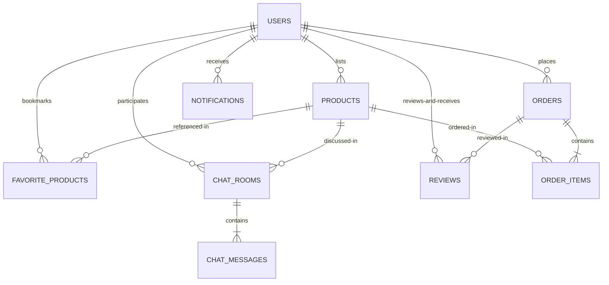

# 06. Database Documentation

The **ĐồCũ** secondhand e-commerce platform implements a **Database-per-Service** pattern to isolate transaction boundaries and prevent cross-domain database contention. 

---

## 1. Global ER Diagram (Conceptual)

Although each database is physically isolated in separate MySQL schemas, they are logically connected via identifiers (`user_id`, `product_id`, `order_id`).

---

## 2. Microservice Database Schemas

### 2.1 User Database (`user_db`)

Manages platform users, roles, credentials, and profiles.

#### Table: `users`
| Column | Data Type | Key / Constraints | Description |
| --- | --- | --- | --- |
| `id` | `BIGINT` | **PK**, Auto Increment | Unique user identifier. |
| `name` | `VARCHAR(255)` | `NOT NULL` | Display name of the user. |
| `email` | `VARCHAR(255)` | `UNIQUE`, `NOT NULL` | User email used as login username. |
| `password` | `VARCHAR(255)` | `NOT NULL` | BCrypt encrypted password hash. |
| `phone` | `VARCHAR(255)` | | Contact phone number. |
| `avatar_url` | `VARCHAR(255)` | | Profile picture URL hosted on Media Service. |
| `role` | `VARCHAR(255)` | `NOT NULL`, Default: `'USER'` | Roles: `USER`, `ADMIN`. |
| `created_at` | `DATETIME` | | Registration timestamp. |

---

### 2.2 Product Database (`product_db`)

Manages categories, active postings, and favorite bookmarks.

#### Table: `products`
| Column | Data Type | Key / Constraints | Description |
| --- | --- | --- | --- |
| `id` | `BIGINT` | **PK**, Auto Increment | Unique product identifier. |
| `name` | `VARCHAR(255)` | | Product display title. |
| `description` | `VARCHAR(255)` | | Item description. |
| `price` | `DOUBLE` | | Sale price in VND. |
| `stock` | `INT` | | Quantity available. |
| `category` | `VARCHAR(255)` | | Name of category this item belongs to. |
| `location` | `VARCHAR(255)` | | Geographical location. |
| `item_condition`| `VARCHAR(255)` | | Condition: `NEW`, `USED`. |
| `status` | `VARCHAR(255)` | | Status: `AVAILABLE`, `SOLD`, `HIDDEN`. |
| `seller_id` | `BIGINT` | `NOT NULL` | Logical reference to `users.id` in `user_db`. |
| `is_approved` | `TINYINT(1)` | `NOT NULL`, Default: `1` | Admin moderation status. |
| `latitude` | `DOUBLE` | | GPS Latitude coordinate. |
| `longitude` | `DOUBLE` | | GPS Longitude coordinate. |
| `created_at` | `DATETIME` | | Post creation timestamp. |
| `bumped_at` | `DATETIME` | | Bump timestamp for sorting listings. |
| `attributes` | `TEXT` | | JSON string representing dynamic specifications. |

#### Table: `product_image_urls`
Joint table generated by `@ElementCollection` for storing product images.
| Column | Data Type | Key / Constraints | Description |
| --- | --- | --- | --- |
| `product_id` | `BIGINT` | **FK** references `products.id` | Associated product. |
| `image_urls` | `VARCHAR(255)` | | Hosted image URL. |

#### Table: `categories`
| Column | Data Type | Key / Constraints | Description |
| --- | --- | --- | --- |
| `id` | `BIGINT` | **PK**, Auto Increment | Category identifier. |
| `name` | `VARCHAR(255)` | `UNIQUE`, `NOT NULL` | Unique category name. |
| `icon_name` | `VARCHAR(255)` | `NOT NULL` | Material Symbols icon tag. |

#### Table: `favorite_products`
| Column | Data Type | Key / Constraints | Description |
| --- | --- | --- | --- |
| `id` | `BIGINT` | **PK**, Auto Increment | Bookmark identifier. |
| `user_id` | `BIGINT` | `NOT NULL` | Logical user reference (`users.id`). |
| `product_id` | `BIGINT` | `NOT NULL` | Logical product reference (`products.id`). |
| `created_at` | `DATETIME` | | Timestamp bookmarked. |

---

### 2.3 Order Database (`order_db`)

Manages transactional details.

#### Table: `orders`
| Column | Data Type | Key / Constraints | Description |
| --- | --- | --- | --- |
| `id` | `BIGINT` | **PK**, Auto Increment | Unique order identifier. |
| `user_id` | `BIGINT` | | Buyer user reference. |
| `total_amount` | `DOUBLE` | | Combined order total price. |
| `created_at` | `DATETIME` | | Date order placed. |

#### Table: `order_items`
Stores the breakdown of products purchased within an order.
| Column | Data Type | Key / Constraints | Description |
| --- | --- | --- | --- |
| `order_id` | `BIGINT` | **FK** references `orders.id` | Associated order. |
| `product_id` | `BIGINT` | | Logical reference to `products.id`. |
| `quantity` | `INT` | | Amount purchased. |
| `unit_price` | `DOUBLE` | | Price per unit at purchase time. |

---

### 2.4 Chat Database (`chat_db`)

Tracks conversations and archived logs.

#### Table: `chat_rooms`
| Column | Data Type | Key / Constraints | Description |
| --- | --- | --- | --- |
| `id` | `BIGINT` | **PK**, Auto Increment | Chat room identifier. |
| `buyer_id` | `BIGINT` | `NOT NULL` | Logical reference of buyer (`users.id`). |
| `seller_id` | `BIGINT` | `NOT NULL` | Logical reference of seller (`users.id`). |
| `product_id` | `BIGINT` | | Logical product discussed (`products.id`). |
| `created_at` | `DATETIME` | | Chat room creation timestamp. |
| `updated_at` | `DATETIME` | | Last message timestamp. |

* **Unique Constraint**: A composite unique key is set on `(buyer_id, seller_id, product_id)` to prevent redundant rooms.

#### Table: `chat_messages`
| Column | Data Type | Key / Constraints | Description |
| --- | --- | --- | --- |
| `id` | `BIGINT` | **PK**, Auto Increment | Message identifier. |
| `chat_room_id` | `BIGINT` | **FK** references `chat_rooms.id` | Associated room. |
| `sender_id` | `BIGINT` | `NOT NULL` | Sender user reference. |
| `content` | `TEXT` | `NOT NULL` | Message payload (text, image URL, maps link). |
| `message_type` | `VARCHAR(255)`| | Type: `TEXT`, `IMAGE`, `LOCATION`. |
| `is_read` | `TINYINT(1)` | Default: `0` | Message read status flag. |
| `created_at` | `DATETIME` | | Message timestamp. |

---

### 2.5 Notification Database (`notification_db`)

Manages asynchronous alert logs.

#### Table: `notifications`
| Column | Data Type | Key / Constraints | Description |
| --- | --- | --- | --- |
| `id` | `BIGINT` | **PK**, Auto Increment | Alert identifier. |
| `user_id` | `BIGINT` | `NOT NULL` | Recipient user reference. |
| `message` | `TEXT` | `NOT NULL` | Display message alert text. |
| `is_read` | `TINYINT(1)` | Default: `0` | Status read flag. |
| `type` | `VARCHAR(255)` | | Type: `CHAT`, `ORDER`, `SYSTEM`. |
| `created_at` | `DATETIME` | | Creation timestamp. |

---

### 2.6 Review Database (`review_db`)

Handles peer review logs.

#### Table: `reviews`
| Column | Data Type | Key / Constraints | Description |
| --- | --- | --- | --- |
| `id` | `BIGINT` | **PK**, Auto Increment | Review identifier. |
| `reviewer_id` | `BIGINT` | `NOT NULL` | User writing the review. |
| `reviewed_user_id`| `BIGINT` | `NOT NULL` | Seller being reviewed. |
| `order_id` | `BIGINT` | | Associated order reference (optional). |
| `rating` | `INT` | `NOT NULL` | Score mapping from 1 to 5. |
| `comment` | `TEXT` | | Feedback text. |
| `seller_reply` | `TEXT` | | Seller's rebuttal/acknowledgement comment. |
| `replied_at` | `DATETIME` | | Timestamp of seller reply. |
| `created_at` | `DATETIME` | | Date review written. |

#### Table: `review_images`
Joint table for review image attachments.
| Column | Data Type | Key / Constraints | Description |
| --- | --- | --- | --- |
| `review_id` | `BIGINT` | **FK** references `reviews.id` | Associated review. |
| `image_url` | `VARCHAR(255)` | | Image link attachment. |

---

## 3. Database Normalization & Design Notes

1. **Logical Foreign Keys**: Constraints between entities from different databases (e.g. `seller_id` in `product-service` referencing a user in `user-service`) are **not** declared as physical foreign keys in MySQL. Since they reside on separate MySQL ports and server instances, physical foreign keys are impossible. Referential integrity is maintained programmatically in the Service layer.
2. **Third Normal Form (3NF)**: Core tables (`users`, `products`, `orders`) conform to 3NF standards, reducing redundancies. Dynamic parameters are handled safely using attributes stored in string TEXT format (e.g., `Product.attributes`), representing a semi-structured NoSQL approach inside MySQL to handle the heterogeneous nature of secondhand postings.
3. **Implicit Indexing**: Unique fields (e.g., `users.email`, `categories.name`, and the composite unique constraint on `chat_rooms(buyer_id, seller_id, product_id)`) are automatically indexed by MySQL.
