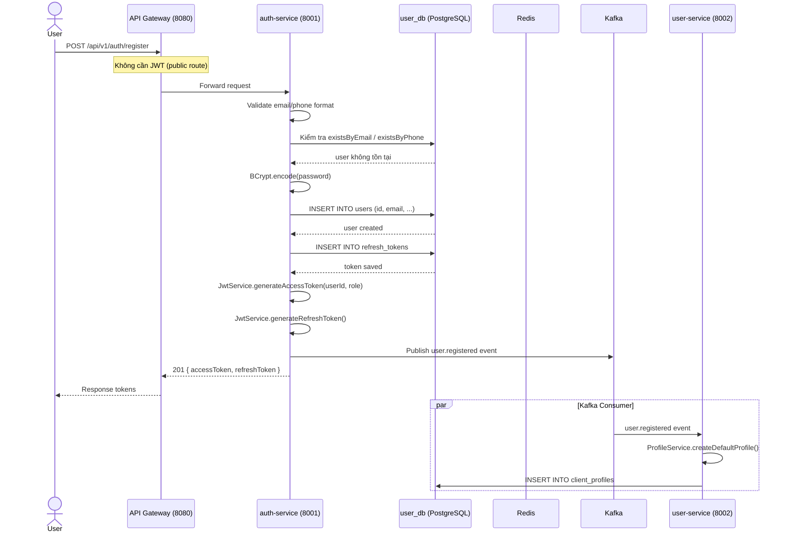
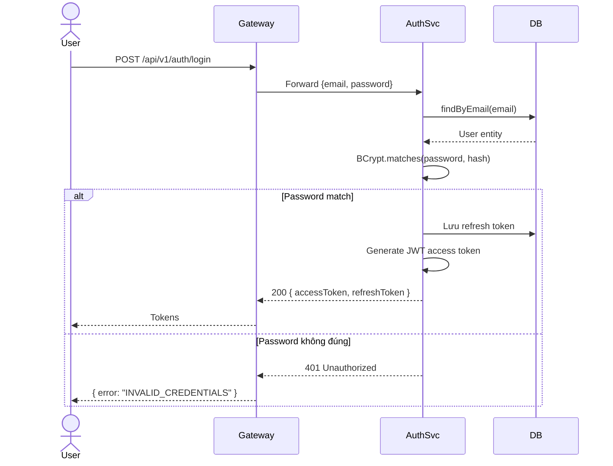
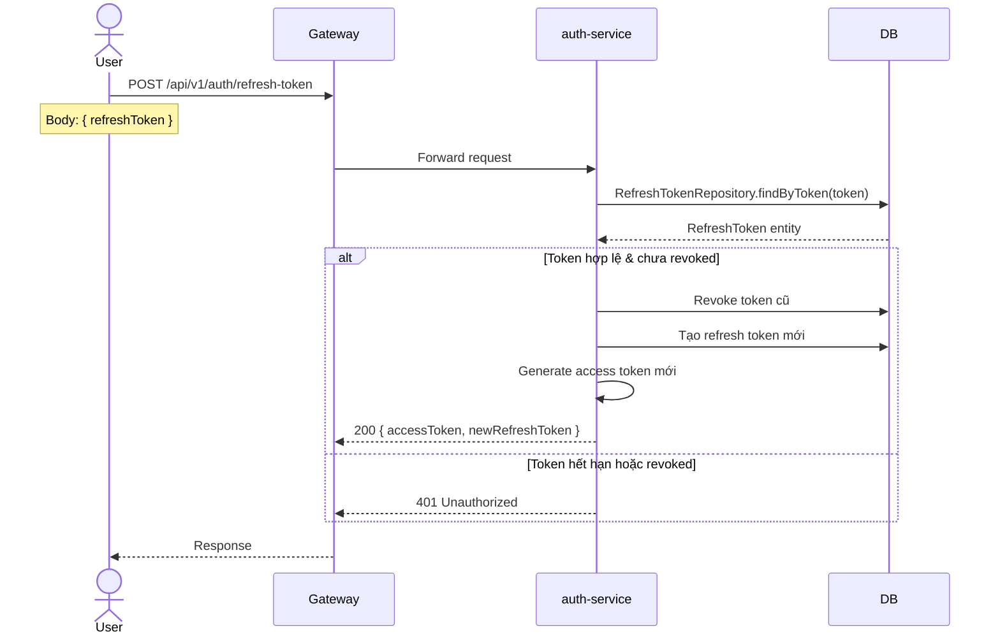
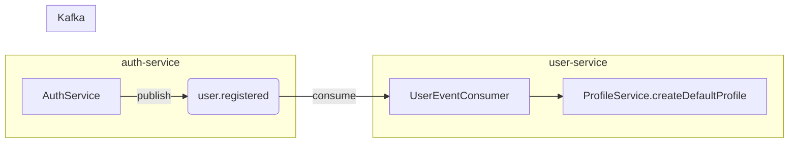

# 01 — User Registration & Authentication Flow

## Tổng quan

Quản lý đăng ký tài khoản, đăng nhập, và refresh token cho người dùng (C2C e-commerce).

**Services tham gia:**
- `api-gateway` (port 8080) — routing, JWT validation, forward headers
- `auth-service` (port 8001) — xử lý authentication, JWT generation
- `user-service` (port 8002) — tạo profile mặc định
- `config-server` (port 8888) — cung cấp cấu hình

**Database:** `user_db` PostgreSQL — `users`, `refresh_tokens`
**Cache:** Redis — blacklist token, session cache
**Kafka topic:** `user.registered`

---

## 1. Đăng ký (Registration)



### Các bước chi tiết

| Bước | Mô tả | File/Lớp |
|------|-------|----------|
| 1 | User gửi POST `/api/v1/auth/register` với body `{email, phone, password, fullName}` | `AuthController.java` |
| 2 | Gateway nhận request, public route (không filter JWT) | `GatewayConfig.java` |
| 3 | `AuthService.register()` validate dữ liệu đầu vào | `AuthService.java` |
| 4 | Kiểm tra duplicate: `existsByEmail` / `existsByPhone` | `UserRepository.java` |
| 5 | Hash password bằng BCrypt | `SecurityConfig.java` |
| 6 | Lưu `User` entity vào `users` table | `User.java` |
| 7 | Lưu `RefreshToken` vào `refresh_tokens` table | `RefreshToken.java` |
| 8 | Generate JWT access token + refresh token | `JwtService.java`, `JwtConfig.java` |
| 9 | Publish `user.registered` event lên Kafka | `UserEventProducer.java` |
| 10 | Return 201 với cặp token | `AuthController.java` |

### Xử lý lỗi

| Lỗi | HTTP Status | ErrorCode |
|-----|-------------|-----------|
| Email đã tồn tại | 409 Conflict | `USER_ALREADY_EXISTS` (4000) |
| SĐT đã tồn tại | 409 Conflict | `PHONE_ALREADY_EXISTS` |
| Validation fail (email invalid, password yếu) | 400 Bad Request | `VALIDATION_ERROR` (4500) |

---

## 2. Đăng nhập (Login)



### Các bước chi tiết

| Bước | Mô tả | File/Lớp |
|------|-------|----------|
| 1 | User gửi `POST /api/v1/auth/login` với `{email, password}` | `AuthController` |
| 2 | `AuthService.login()` tìm user theo email | `UserRepository.findByEmail()` |
| 3 | So sánh password với BCrypt | `BCryptPasswordEncoder` |
| 4 | Nếu đúng: generate access + refresh token | `JwtService` |
| 5 | Nếu sai: throw `BusinessException(INVALID_CREDENTIALS)` | `AuthService` |

### Token details

| Token | Thời hạn | Mục đích |
|-------|----------|----------|
| Access Token | 15 phút (JWT) | Xác thực request đến các service |
| Refresh Token | 7 ngày (DB) | Lấy access token mới |

---

## 3. Refresh Token



---

## 4. Event Flow (user.registered)



**Payload `user.registered`:**
```json
{
  "userId": "uuid",
  "email": "user@example.com",
  "fullName": "Nguyen Van A",
  "role": "ROLE_USER"
}
```

---

## 5. Cấu trúc Database

### users
| Column | Type | Ghi chú |
|--------|------|---------|
| id | UUID (PK) | Generated |
| email | VARCHAR(255) | UNIQUE |
| phone | VARCHAR(20) | UNIQUE |
| password_hash | VARCHAR(255) | BCrypt |
| full_name | VARCHAR(255) | |
| role | VARCHAR(20) | ROLE_USER / ROLE_SELLER / ROLE_ADMIN |
| is_active | BOOLEAN | Default true |

### refresh_tokens
| Column | Type | Ghi chú |
|--------|------|---------|
| id | UUID (PK) | |
| token | VARCHAR(255) | UNIQUE |
| user_id | UUID (FK → users) | |
| expiry_date | TIMESTAMP | |
| revoked | BOOLEAN | |

## 6. Security

- Mật khẩu lưu dạng BCrypt hash
- JWT signed với HMAC-SHA512
- Refresh token lưu DB, single-use (revoke sau khi dùng)
- Public routes: `/api/v1/auth/**`, `/api/v1/tokens/**`
- Gateway filter inject `X-User-Id`, `X-User-Role` headers
