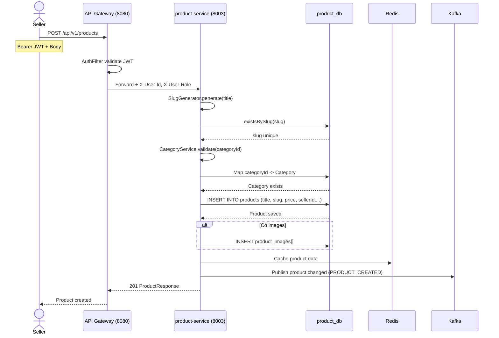
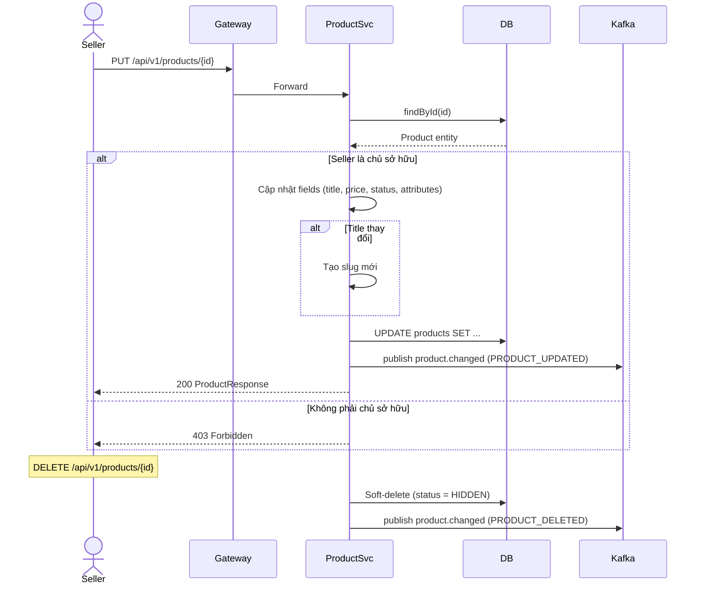
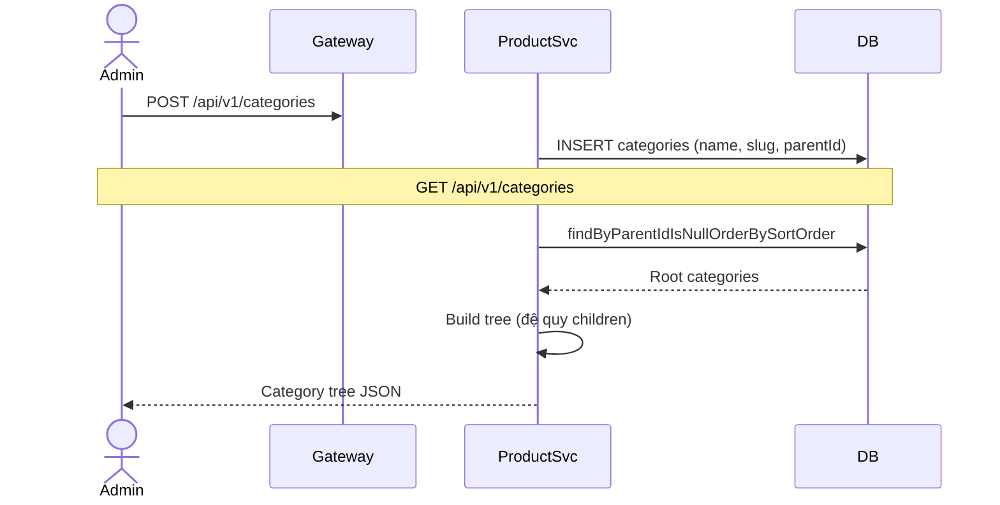
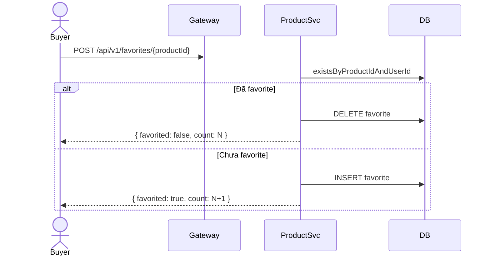
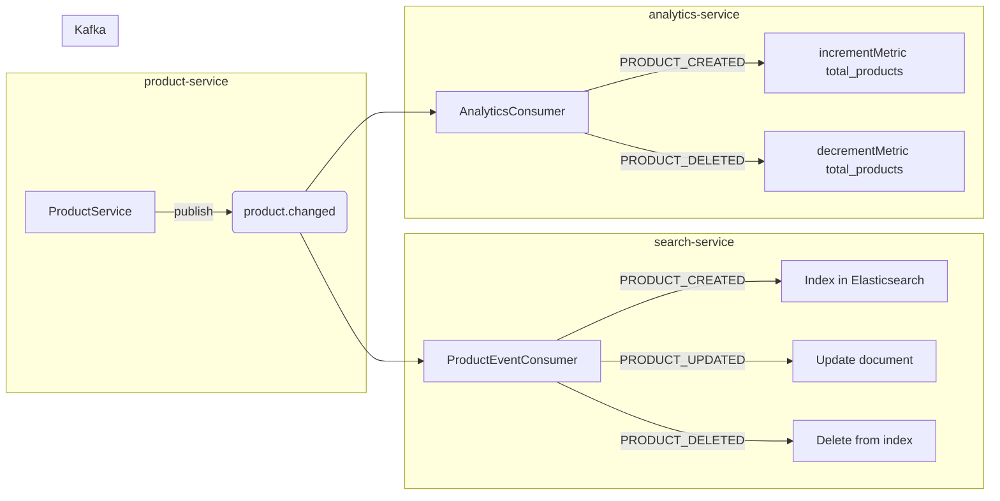
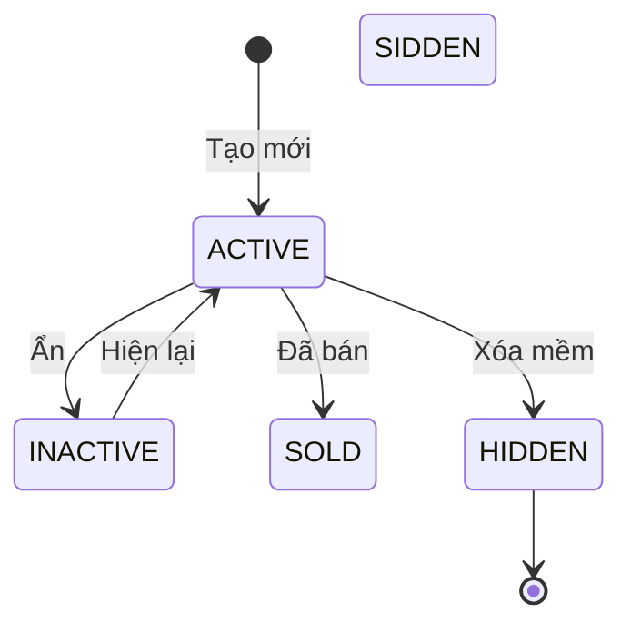

# 02 — Product Management Flow

## Tổng quan

Quản lý vòng đời sản phẩm: CRUD sản phẩm, danh mục, hình ảnh, và tính năng yêu thích.

**Services tham gia:**
- `api-gateway` (port 8080) — routing, JWT filter
- `product-service` (port 8003) — business logic
- `search-service` (port 8004) — đồng bộ Elasticsearch (qua Kafka)

**Database:** `product_db` PostgreSQL — `products`, `categories`, `product_images`, `product_favorites`, `boost_packages`
**Cache:** Redis — product cache
**Kafka topic:** `product.changed`

---

## 1. Tạo sản phẩm



### Request / Response

**Request:**
```json
POST /api/v1/products
{
  "title": "iPhone 14 Pro Max 256GB",
  "description": "Mới 99%, đầy đủ phụ kiện",
  "price": 25000000,
  "currency": "VND",
  "categoryId": 1,
  "attributes": {
    "color": "Deep Purple",
    "storage": "256GB",
    "ram": "6GB"
  }
}
```

**Response:**
```json
{
  "id": 1,
  "title": "iPhone 14 Pro Max 256GB",
  "slug": "iphone-14-pro-max-256gb",
  "status": "ACTIVE",
  "price": 25000000,
  "viewCount": 0,
  "favoriteCount": 0,
  "createdAt": "2026-07-03T08:00:00"
}
```

### Xử lý lỗi

| Lỗi | HTTP Status | ErrorCode |
|-----|-------------|-----------|
| Slug trùng (sau retry) | 409 Conflict | `SLUG_DUPLICATE` |
| Category không tồn tại | 404 Not Found | `CATEGORY_NOT_FOUND` |
| Price <= 0 | 400 Bad Request | `VALIDATION_ERROR` |
| Seller không có quyền | 403 Forbidden | `ACCESS_DENIED` |

---

## 2. Cập nhật & Xóa sản phẩm



---

## 3. Danh mục (Category)



### Category tree structure

```json
[
  {
    "id": 1, "name": "Điện thoại", "slug": "dien-thoai",
    "children": [
      { "id": 2, "name": "iPhone", "slug": "iphone" },
      { "id": 3, "name": "Samsung", "slug": "samsung" }
    ]
  },
  {
    "id": 4, "name": "Thời trang", "slug": "thoi-trang",
    "children": [
      { "id": 5, "name": "Áo nam", "slug": "ao-nam" }
    ]
  }
]
```

---

## 4. Yêu thích (Favorite)



---

## 5. Event Flow (product.changed)



**Payload `product.changed`:**
```json
{
  "eventType": "PRODUCT_CREATED",
  "productId": 1,
  "title": "iPhone 14 Pro Max 256GB",
  "price": 25000000,
  "categoryId": 2,
  "sellerId": "uuid",
  "status": "ACTIVE"
}
```

---

## 6. State Machine — Product Status



| Status | Ý nghĩa |
|--------|---------|
| ACTIVE | Đang hiển thị, có thể mua |
| INACTIVE | Tạm ẩn (seller tự ẩn) |
| SOLD | Đã bán (sau khi có order) |
| HIDDEN | Xóa mềm (soft-delete) |
