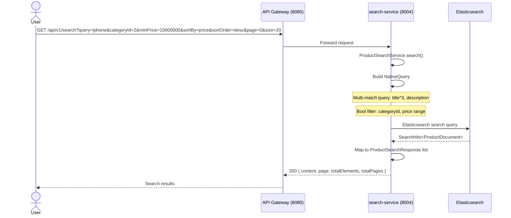
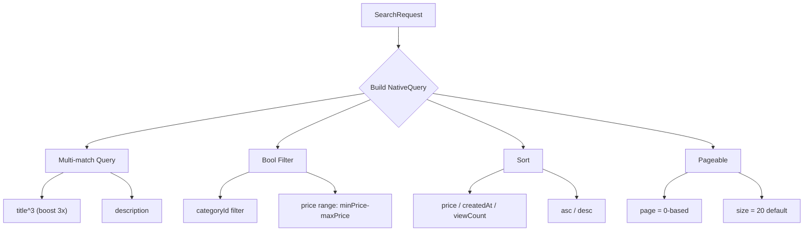
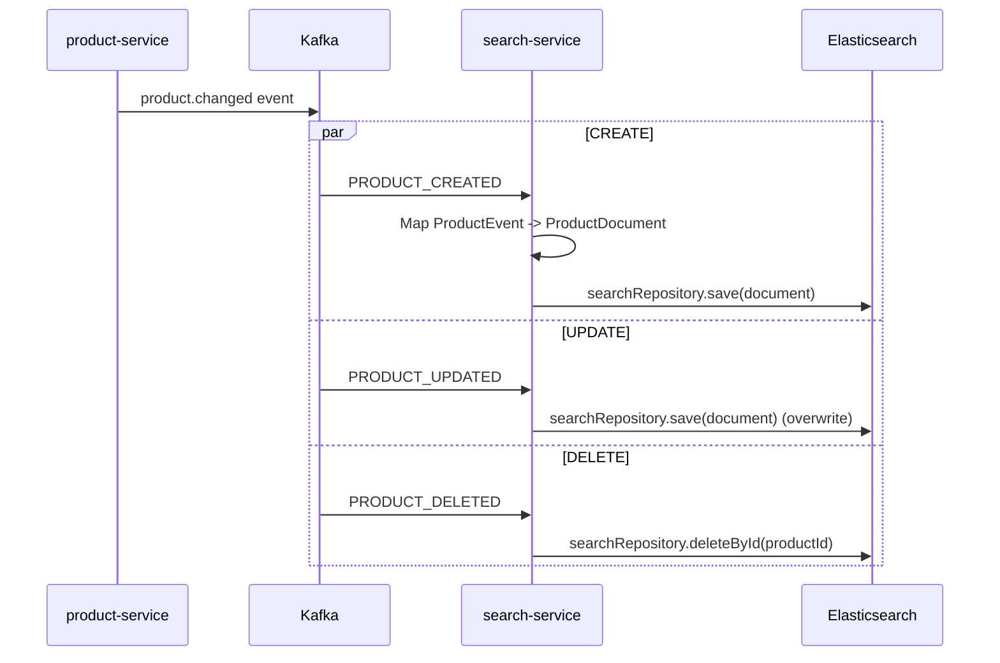
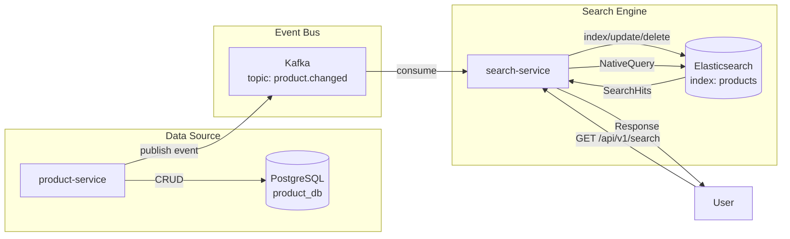

# 03 — Product Search Flow

## Tổng quan

Tìm kiếm sản phẩm full-text với filter, sorting, và pagination sử dụng Elasticsearch.

**Services tham gia:**
- `api-gateway` (port 8080) — routing
- `product-service` (port 8003) — nguồn dữ liệu gốc
- `search-service` (port 8004) — Elasticsearch search engine

**Database:** Elasticsearch index `products`
**Kafka topic:** `product.changed` (đồng bộ từ product-service)

---

## 1. Tìm kiếm sản phẩm



### Xây dựng query



### Query parameters

| Parameter | Type | Mô tả | Default |
|-----------|------|-------|---------|
| `query` | String | Từ khóa tìm kiếm | "" |
| `categoryId` | Long | Lọc theo danh mục | null |
| `minPrice` | BigDecimal | Giá thấp nhất | null |
| `maxPrice` | BigDecimal | Giá cao nhất | null |
| `sortBy` | String | price / createdAt / viewCount | createdAt |
| `sortOrder` | String | asc / desc | desc |
| `page` | int | Số trang (0-index) | 0 |
| `size` | int | Số item mỗi trang | 20 |

---

## 2. Đồng bộ Elasticsearch



### Elasticsearch Document Mapping

```json
{
  "products": {
    "mappings": {
      "properties": {
        "productId":    { "type": "long" },
        "title":        { "type": "text", "analyzer": "standard" },
        "description":  { "type": "text" },
        "price":        { "type": "double" },
        "currency":     { "type": "keyword" },
        "categoryId":   { "type": "long" },
        "categoryName": { "type": "keyword" },
        "sellerId":     { "type": "keyword" },
        "sellerName":   { "type": "keyword" },
        "status":       { "type": "keyword" },
        "imageUrls":    { "type": "keyword" },
        "viewCount":    { "type": "long" },
        "favoriteCount":{ "type": "long" },
        "createdAt":    { "type": "date" },
        "updatedAt":    { "type": "date" }
      }
    }
  }
}
```

---

## 3. Kiến trúc đồng bộ



---

## 4. Xử lý lỗi

| Tình huống | Xử lý |
|------------|-------|
| Elasticsearch down | Throw `BusinessException(SEARCH_UNAVAILABLE)` |
| Index chưa được tạo | Auto-create mapping khi save document đầu tiên |
| Query syntax error | Log error, trả về empty result |
| Event không đồng bộ kịp | Eventual consistency — tối đa vài giây |

---

## 5. Lưu ý

- Chỉ index product có `status = ACTIVE` (filter khi consumer nhận event)
- Search không cần authentication (public route)
- `title` được boost 3x so với `description`
- Suggestion API (`/api/v1/suggestions`) chưa implement — có thể dùng completion suggester của ES
