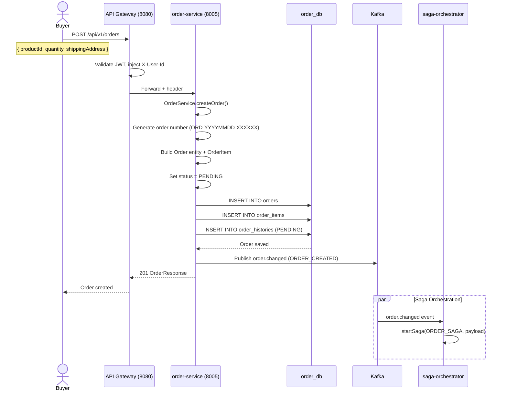
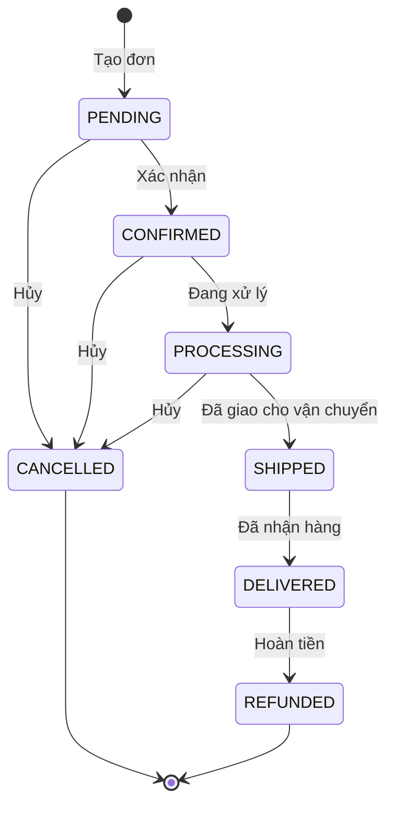
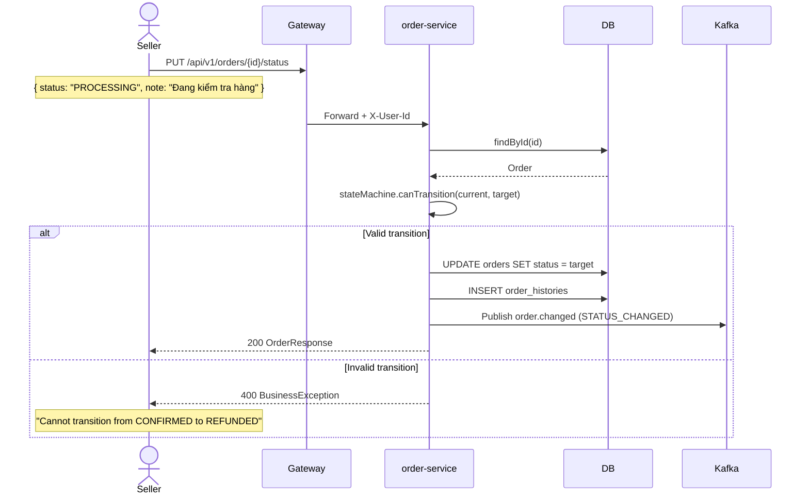
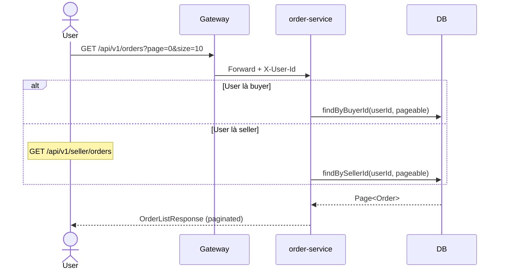
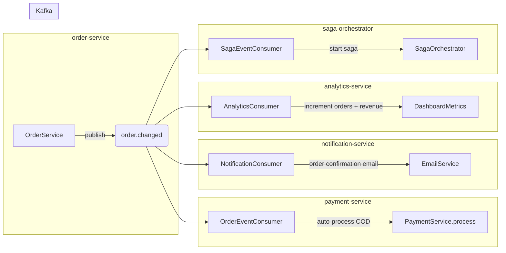

# 04 — Order Placement Flow

## Tổng quan

Xử lý toàn bộ vòng đời đơn hàng: tạo đơn, chuyển trạng thái, và distributed transaction qua Saga.

**Services tham gia:**
- `api-gateway` (port 8080) — routing, JWT
- `order-service` (port 8005) — business logic, state machine
- `saga-orchestrator` (port 8010) — distributed transaction
- `payment-service` (port 8006) — xử lý thanh toán
- `notification-service` (port 8008) — gửi thông báo
- `product-service` (port 8003) — validate sản phẩm

**Database:** `order_db` PostgreSQL — `orders`, `order_items`, `order_histories`
**Kafka topics:** `order.changed`, `payment.changed`, `saga.events`

---

## 1. Tạo đơn hàng



### Order Number Format

`ORD-YYYYMMDD-XXXXXX`
- VD: `ORD-20260703-000001`
- Tự động tăng theo ngày (reset hàng ngày)

### Request / Response

**Request:**
```json
POST /api/v1/orders
{
  "productId": 1,
  "quantity": 1,
  "shippingAddress": {
    "fullName": "Nguyen Van A",
    "phone": "0909123456",
    "address": "123 Nguyen Hue",
    "ward": "Ben Nghe",
    "district": "District 1",
    "province": "Ho Chi Minh"
  }
}
```

**Response:**
```json
{
  "id": "uuid",
  "orderNumber": "ORD-20260703-000001",
  "status": "PENDING",
  "totalAmount": 25000000,
  "items": [{ "productId": 1, "quantity": 1, "subtotal": 25000000 }]
}
```

---

## 2. State Machine — Order Status



### Ma trận chuyển trạng thái

| Từ → Đến | Điều kiện | Ai thực hiện |
|-----------|-----------|-------------|
| PENDING → CONFIRMED | Thanh toán thành công | Hệ thống |
| PENDING → CANCELLED | Buyer hủy | Buyer |
| CONFIRMED → PROCESSING | Seller xác nhận | Seller |
| CONFIRMED → CANCELLED | Seller từ chối | Seller |
| PROCESSING → SHIPPED | Đã giao vận chuyển | Seller |
| PROCESSING → CANCELLED | Seller hủy | Seller |
| SHIPPED → DELIVERED | Buyer xác nhận | Buyer |
| DELIVERED → REFUNDED | Yêu cầu hoàn tiền | Hệ thống |

---

## 3. Cập nhật trạng thái



---

## 4. Danh sách đơn hàng



---

## 5. Event Flow



**Payload `order.changed`:**
```json
{
  "eventType": "ORDER_CREATED",
  "orderId": "uuid",
  "orderNumber": "ORD-20260703-000001",
  "buyerId": "uuid",
  "sellerId": "uuid",
  "totalAmount": 25000000,
  "status": "PENDING"
}
```

---

## 6. Xử lý lỗi

| Tình huống | Xử lý |
|------------|-------|
| Sản phẩm không tồn tại | Saga compensate — refund nếu đã thanh toán |
| Thanh toán thất bại | Order remain PENDING, không chuyển CONFIRMED |
| Hủy khi đã SHIPPED | Không cho phép (state machine reject) |
| DB constraint fail | Rollback transaction, return 500 |
