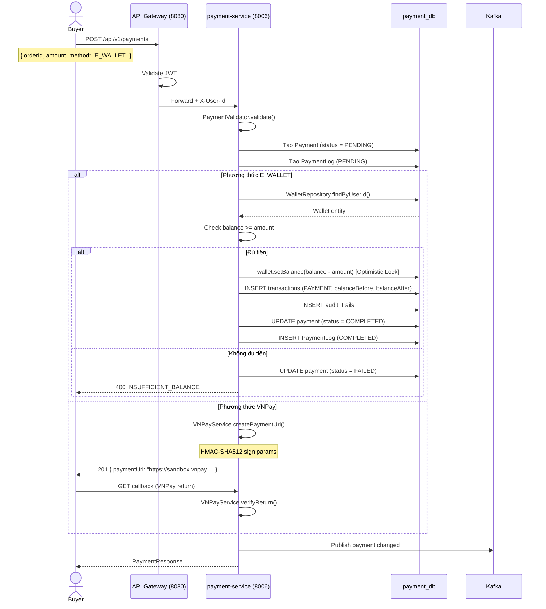
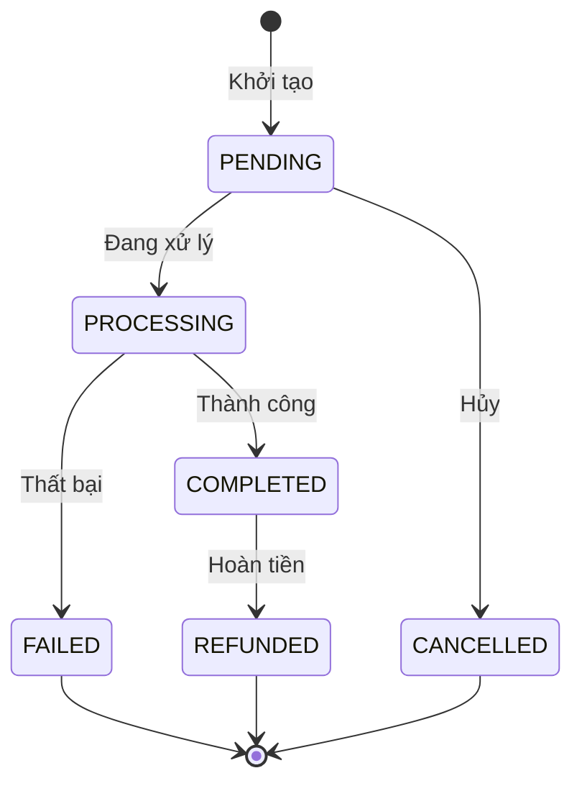
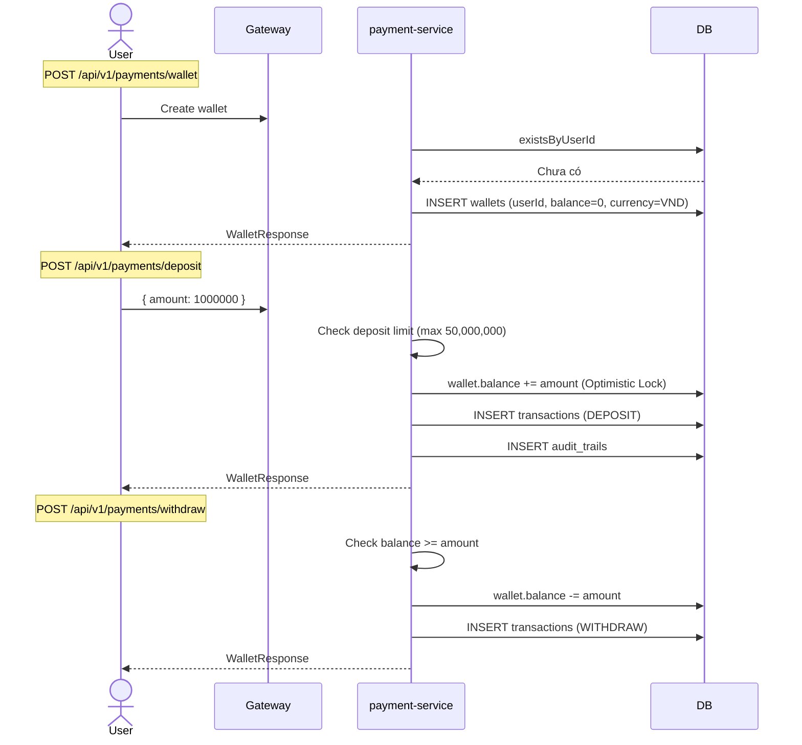
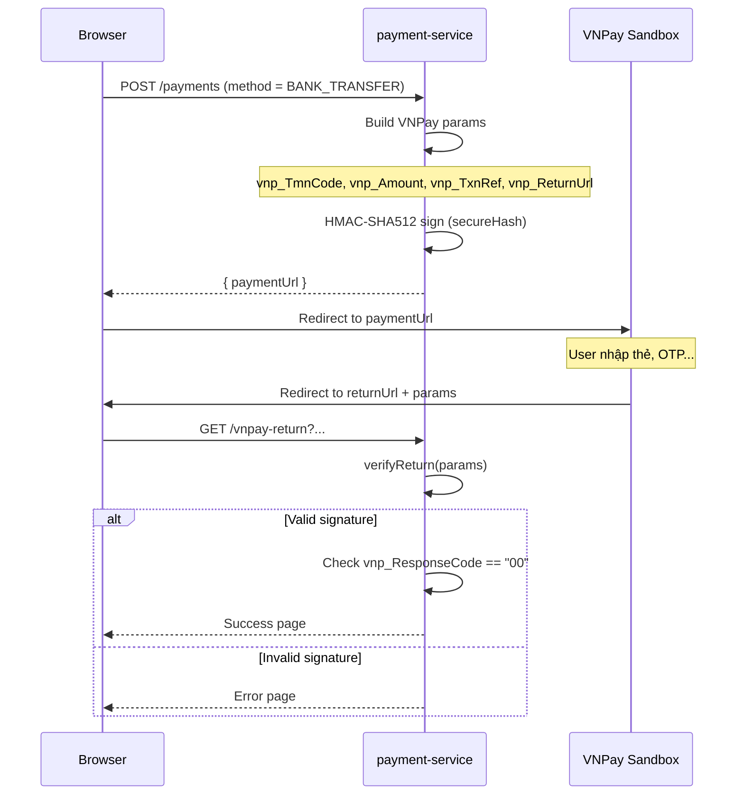
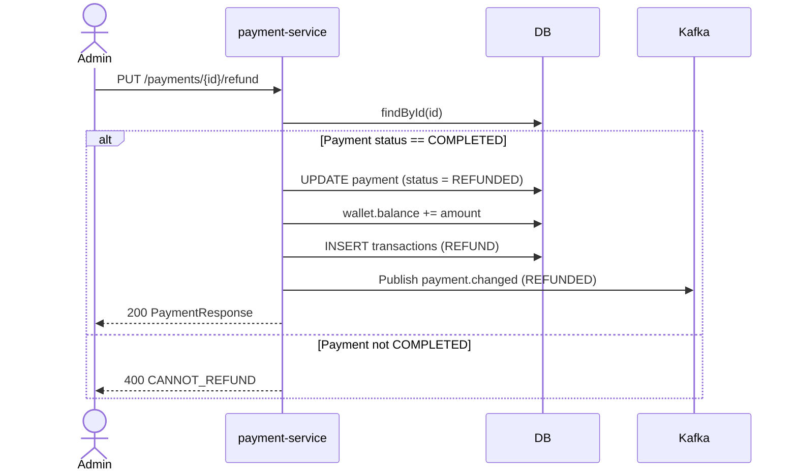
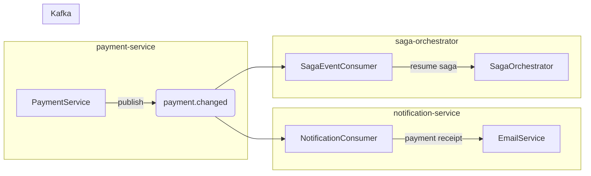

# 05 — Payment Processing Flow

## Tổng quan

Xử lý thanh toán, quản lý ví điện tử, tích hợp VNPay, hoàn tiền.

**Services tham gia:**
- `api-gateway` (port 8080) — routing, JWT
- `payment-service` (port 8006) — business logic
- `order-service` (port 8005) — cập nhật trạng thái đơn hàng
- `notification-service` (port 8008) — thông báo

**Database:** `payment_db` PostgreSQL — `payments`, `wallets`, `transactions`, `payment_logs`, `audit_trails`
**Kafka topics:** `payment.changed`, `order.changed`

---

## 1. Thanh toán đơn hàng



### Payment Status



---

## 2. Ví điện tử (Wallet)



### Wallet Operations

| Endpoint | Mô tả | Validation |
|----------|-------|------------|
| `POST /wallet` | Tạo ví mới | User chưa có ví |
| `GET /wallet` | Xem số dư | — |
| `POST /deposit` | Nạp tiền | Max 50,000,000 VND/lần |
| `POST /withdraw` | Rút tiền | Balance >= amount |
| `POST /hold` | Giữ tiền (đặt cọc) | Balance >= amount |
| `POST /release` | Giải tỏa tiền | Hold reference exists |

### Optimistic Locking

```java
@Entity
public class Wallet {
    @Version
    private Long version; // Optimistic lock
    private BigDecimal balance;
}
```

Wallet sử dụng `@Version` để tránh race condition khi có nhiều giao dịch đồng thời.

---

## 3. VNPay Integration



### VNPay Config

| Property | Value |
|----------|-------|
| `vnpay.tmnCode` | Mã website (VNPay cấp) |
| `vnpay.hashSecret` | Secret key (HMAC-SHA512) |
| `vnpay.paymentUrl` | `https://sandbox.vnpayment.vn/paymentv2/vpcpay.html` |
| `vnpay.returnUrl` | Callback URL |
| `vnpay.apiUrl` | `https://sandbox.vnpayment.vn/merchant_webapi/api/transaction` |

---

## 4. Hoàn tiền (Refund)



---

## 5. Event Flow



**Payload `payment.changed`:**
```json
{
  "eventType": "PAYMENT_COMPLETED",
  "paymentId": "uuid",
  "orderId": "uuid",
  "amount": 25000000,
  "method": "E_WALLET",
  "status": "COMPLETED",
  "transactionId": "TXN-001"
}
```

---

## 6. Xử lý lỗi

| Tình huống | Xử lý |
|------------|-------|
| Không đủ số dư ví | Trả về `INSUFFICIENT_BALANCE` (4600) |
| OptimisticLockException | Retry 3 lần, sau đó fail với `CONCURRENT_TRANSACTION` |
| VNPay signature invalid | Log fraud attempt, không xử lý |
| Refund khi payment chưa COMPLETED | `CANNOT_REFUND` |
| Tạo ví khi đã có | `WALLET_ALREADY_EXISTS` |
