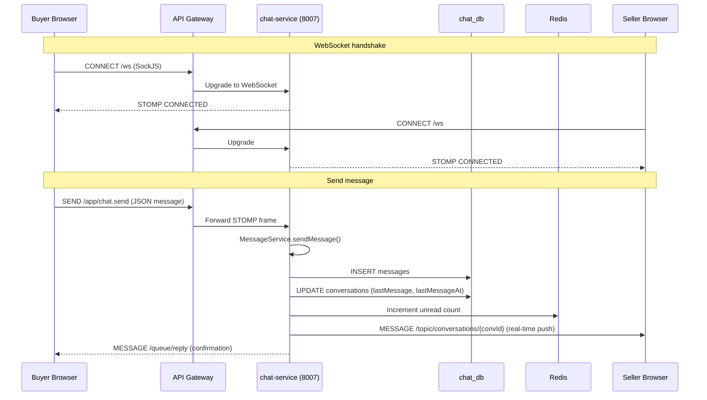
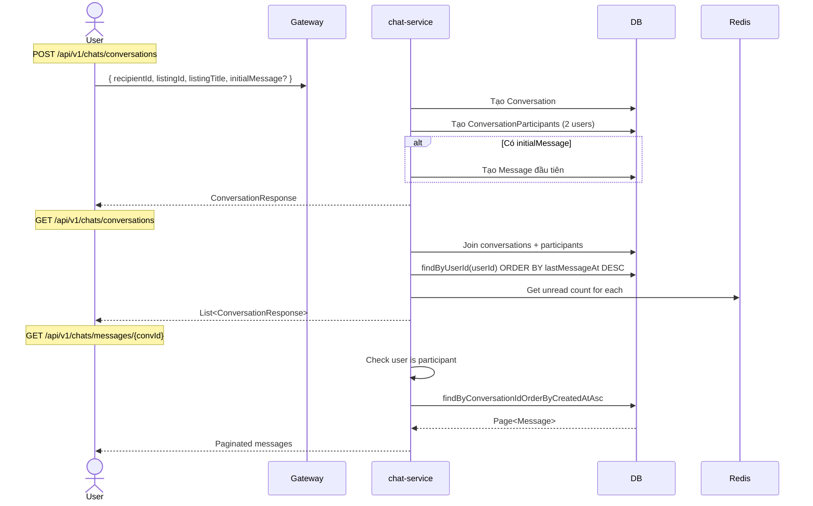
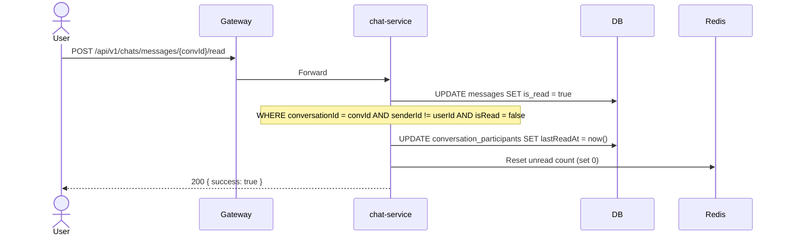
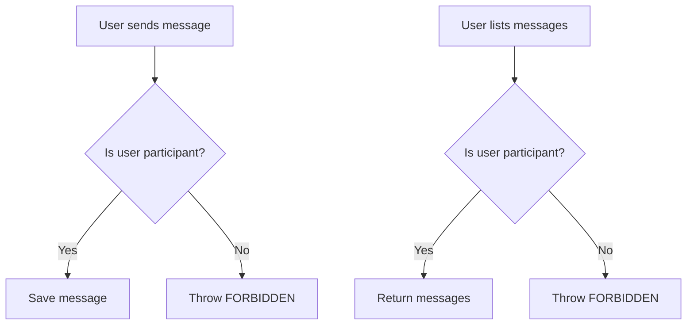
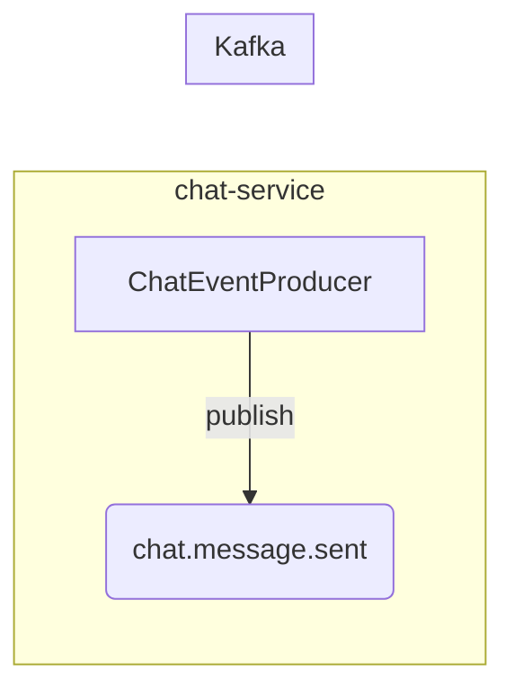

# 06 — Chat & Messaging Flow

## Tổng quan

Nhắn tin realtime giữa người mua và người bán qua WebSocket STOMP + REST API.

**Services tham gia:**
- `api-gateway` (port 8080) — routing, JWT, WebSocket proxy
- `chat-service` (port 8007) — business logic, WebSocket server

**Database:** `chat_db` PostgreSQL — `conversations`, `conversation_participants`, `messages`
**Cache:** Redis — unread count
**WebSocket:** STOMP over SockJS tại `/ws`
**Kafka topic:** `chat.message.sent`

---

## 1. Kiến trúc Realtime



### WebSocket Endpoints

| Endpoint | Mô tả |
|----------|-------|
| `GET /ws` | SockJS WebSocket endpoint (public) |
| `/app/chat.send` | Client → Server: gửi tin nhắn |
| `/topic/conversations/{convId}` | Server → Client: nhận tin nhắn realtime |
| `/user/queue/reply` | Server → Client: confirmation |

### STOMP Message Flow

```
Client → SEND /app/chat.send
  Header: content-type: application/json
  Body: { conversationId, content, clientGeneratedId }

Server → MESSAGE /topic/conversations/{convId}
  Body: MessageResponse (id, senderId, content, createdAt, clientGeneratedId)

Server → MESSAGE /user/queue/reply (to sender only)
  Body: { status: "sent", messageId, clientGeneratedId }
```

---

## 2. REST API — Hội thoại



### Conversation Response

```json
{
  "id": "uuid",
  "listingId": 1,
  "listingTitle": "iPhone 14 Pro Max",
  "lastMessage": "Còn hàng không bạn?",
  "lastMessageAt": "2026-07-03T08:30:00",
  "unreadCount": 3,
  "otherUserId": "seller-uuid",
  "otherUserName": "Nguyen Van B"
}
```

---

## 3. Mark as Read



---

## 4. Participants & Access Control



### Conversation Participants Table

| Column | Type | Ghi chú |
|--------|------|---------|
| conversation_id | UUID (FK) | |
| user_id | UUID | |
| last_read_at | TIMESTAMP | |
| last_read_message_id | UUID | |

Unique constraint: `(conversation_id, user_id)`

---

## 5. Event Flow



**Payload `chat.message.sent`:**
```json
{
  "messageId": "uuid",
  "conversationId": "uuid",
  "senderId": "uuid",
  "recipientId": "uuid",
  "content": "Còn hàng không bạn?",
  "messageType": "TEXT",
  "createdAt": "2026-07-03T08:30:00"
}
```

---

## 6. Xử lý lỗi

| Tình huống | Xử lý |
|------------|-------|
| WebSocket disconnect | Tin nhắn vẫn lưu DB, đồng bộ khi reconnect |
| Người gửi không phải participant | 403 FORBIDDEN |
| Conversation không tồn tại | 404 NOT_FOUND |
| Tin nhắn rỗng | 400 VALIDATION_ERROR |
| Redis unavailable | Unread count fallback về DB query |
