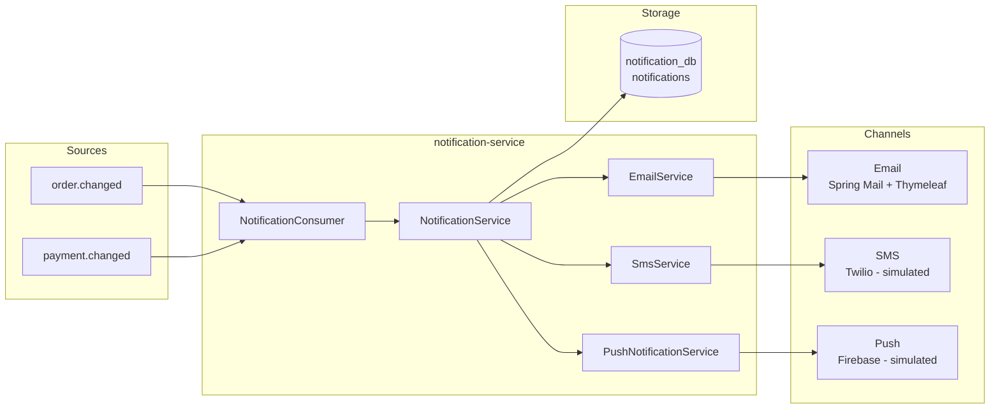
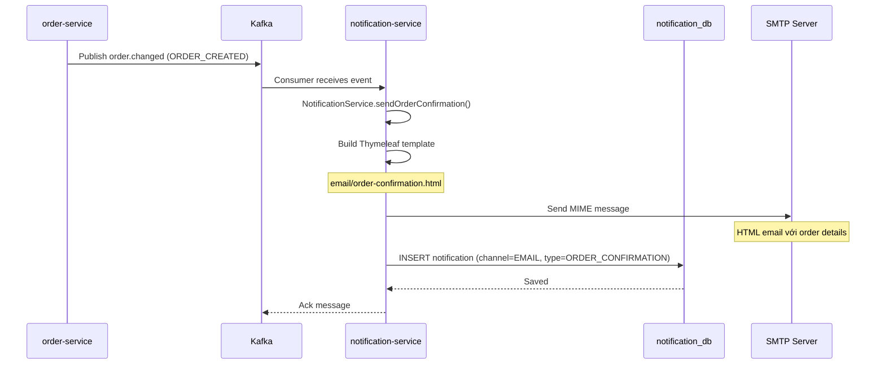
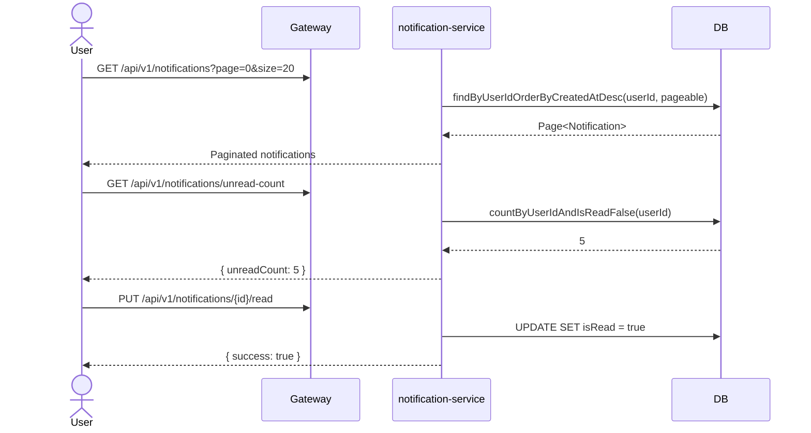
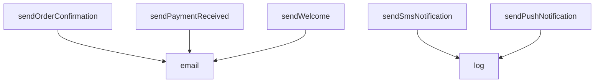
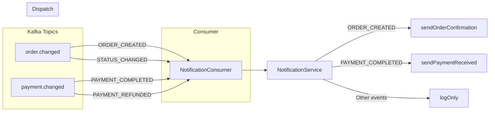

# 07 — Notification Flow

## Tổng quan

Gửi thông báo đa kênh (Email/SMS/Push) khi có sự kiện trong hệ thống.

**Services tham gia:**
- `notification-service` (port 8008) — xử lý và gửi thông báo
- `order-service` (port 8005) — source event
- `payment-service` (port 8006) — source event
- `auth-service` (port 8001) — source event

**Database:** `notification_db` PostgreSQL — `notifications`
**Kafka topics:** `order.changed`, `payment.changed`, `notification.send`

---

## 1. Luồng gửi thông báo tổng quan

---

## 2. Gửi email xác nhận đơn hàng

### Email Templates (Thymeleaf)

| Template | Trigger | Variables |
|----------|---------|-----------|
| `email/order-confirmation.html` | Order created | orderNumber, items, total, address |
| `email/payment-received.html` | Payment completed | amount, method, transactionId |
| `email/welcome.html` | User registered | fullName |

---

## 3. REST API — Truy vấn thông báo

### Notification Model

| Column | Type | Mô tả |
|--------|------|-------|
| id | UUID (PK) | |
| user_id | UUID | Người nhận |
| type | VARCHAR | ORDER_CONFIRMATION, PAYMENT_RECEIVED, WELCOME |
| title | VARCHAR | Tiêu đề |
| body | TEXT | Nội dung |
| channel | VARCHAR | EMAIL / SMS / PUSH |
| reference_type | VARCHAR | order, payment |
| reference_id | VARCHAR | ID của đối tượng liên quan |
| is_read | BOOLEAN | Đã đọc? |
| sent_at | TIMESTAMP | |
| read_at | TIMESTAMP | |

---

## 4. Channels Implementation

| Channel | Library | Status |
|---------|---------|--------|
| Email | Spring Mail + Thymeleaf | **Working** — HTML template, MIME |
| SMS | Twilio | **Simulated** — chỉ log |
| Push | Firebase | **Simulated** — chỉ log |

### NotificationService Methods

---

## 5. Event Flow

---

## 6. Xử lý lỗi

| Tình huống | Xử lý |
|------------|-------|
| Mail server down | Log error, notification vẫn lưu DB (status = FAILED) |
| Email invalid | Log và skip |
| Kafka consumer lag | Auto-commit offset, at-least-once delivery |
| Thymeleaf render fail | Fallback text template |
