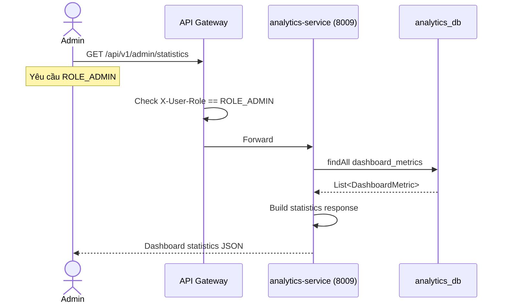
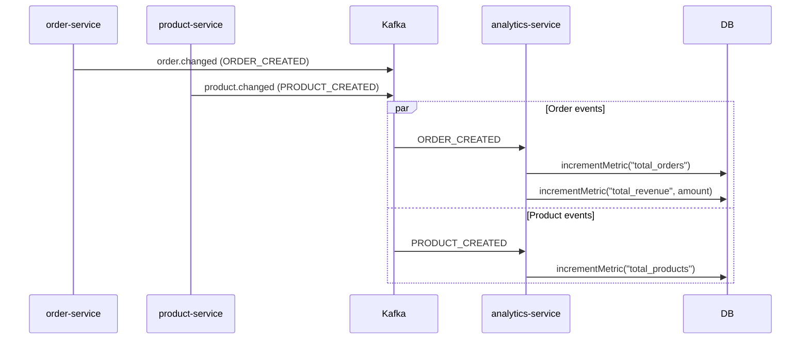
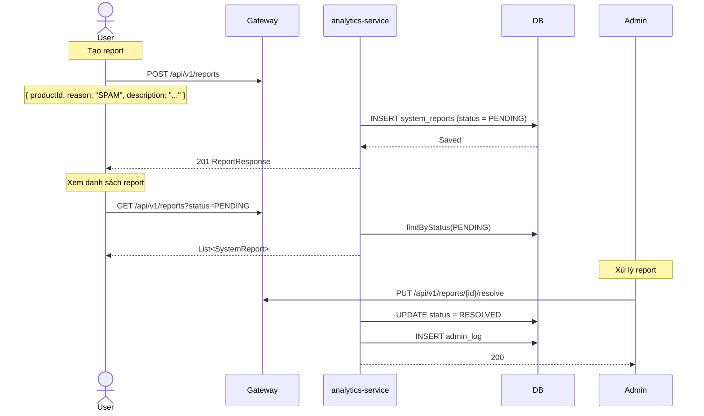
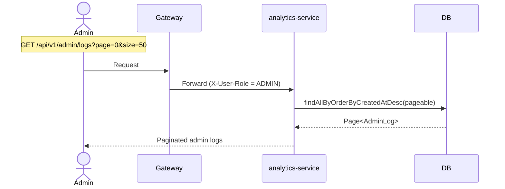
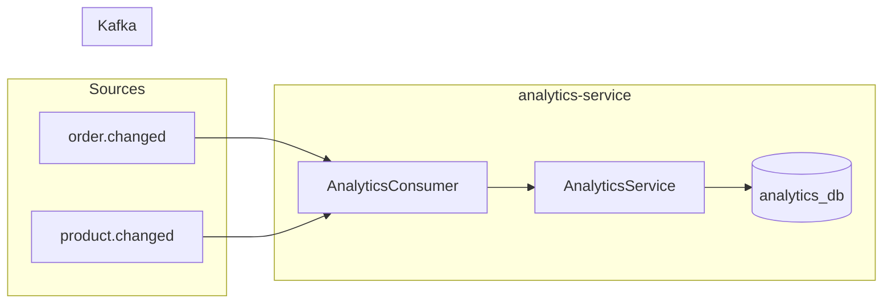

# 08 — Analytics & Reporting Flow

## Tổng quan

Thống kê dashboard, quản lý báo cáo vi phạm, và ghi log hoạt động admin.

**Services tham gia:**
- `api-gateway` (port 8080) — routing, JWT + role check
- `analytics-service` (port 8009) — business logic
- `order-service` (port 8005) — source event
- `product-service` (port 8003) — source event

**Database:** `analytics_db` PostgreSQL — `dashboard_metrics`, `system_reports`, `admin_logs`
**Kafka topics:** `order.changed`, `product.changed`

---

## 1. Dashboard Statistics



### Response

```json
{
  "totalUsers": 1500,
  "totalProducts": 8500,
  "totalOrders": 3200,
  "totalRevenue": 125000000000,
  "pendingReports": 12,
  "resolvedReports": 98,
  "lastUpdated": "2026-07-03T08:00:00"
}
```

---

## 2. Cập nhật metrics (Event-driven)



### DashboardMetric Table

| Column | Type | Mô tả |
|--------|------|-------|
| metric_key | VARCHAR (PK) | "total_users", "total_products", "total_orders", "total_revenue" |
| metric_value | BIGINT | Giá trị hiện tại |
| updated_at | TIMESTAMP | |

---

## 3. Báo cáo vi phạm (System Report)



### SystemReport Status

| Status | Mô tả |
|--------|-------|
| PENDING | Chờ xử lý |
| RESOLVED | Đã giải quyết |

---

## 4. Admin Log



### AdminLog Table

| Column | Type | Mô tả |
|--------|------|-------|
| id | UUID (PK) | |
| admin_id | UUID | Admin thực hiện |
| action | VARCHAR | RESOLVE_REPORT, DELETE_PRODUCT, BAN_USER |
| entity_type | VARCHAR | report, product, user |
| entity_id | VARCHAR | |
| details | TEXT | JSON chi tiết |
| ip_address | VARCHAR | |
| created_at | TIMESTAMP | |

---

## 5. Event Flow



---

## 6. Xử lý lỗi

| Tình huống | Xử lý |
|------------|-------|
| Metric key không tồn tại | Tự động tạo mới với @Query(native) |
| Report trùng product-user | Cho phép nhiều report (mỗi user chỉ 1) |
| Admin không có quyền | 403 FORBIDDEN |
| DB insert fail | Rollback, log error |
