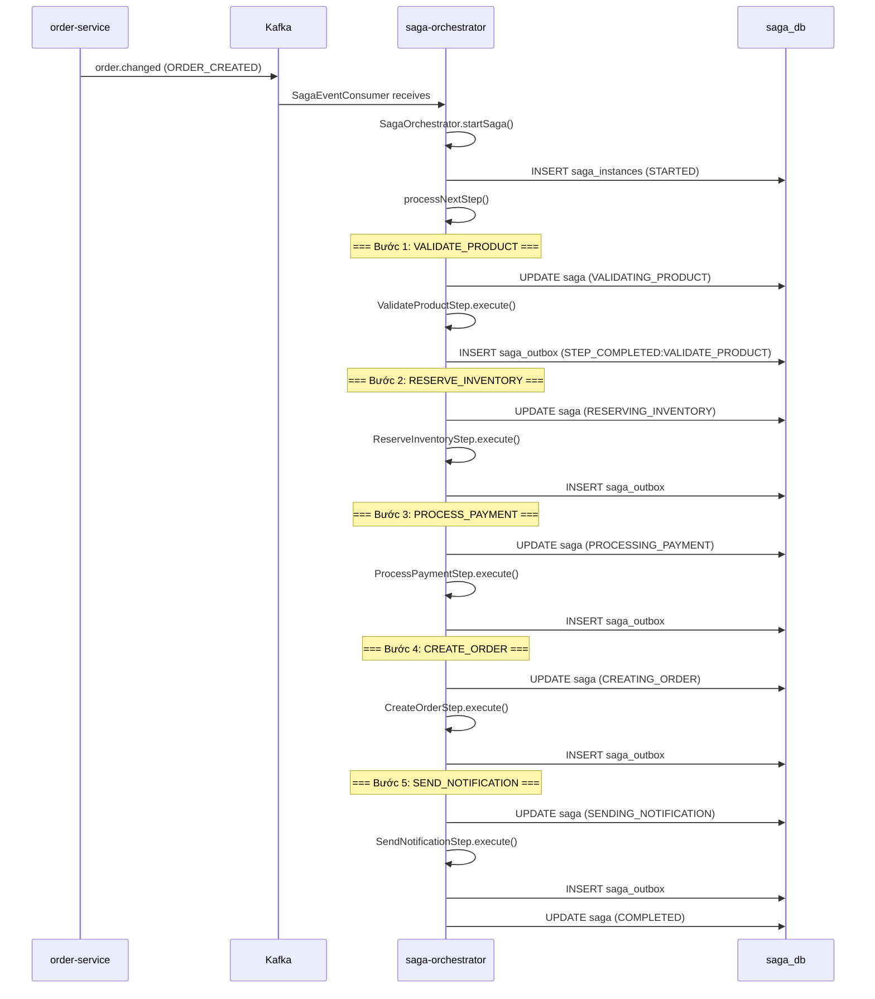
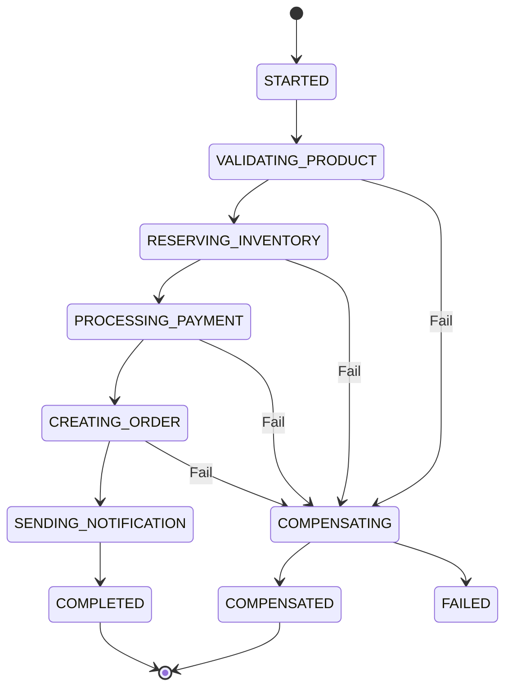
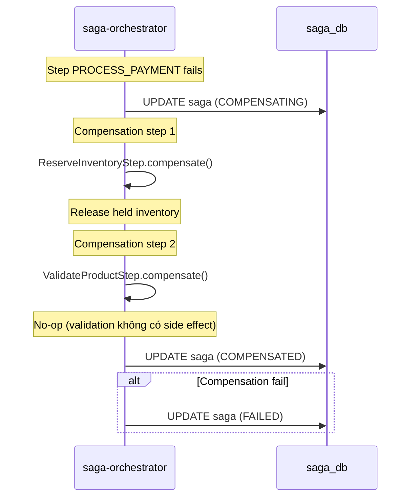
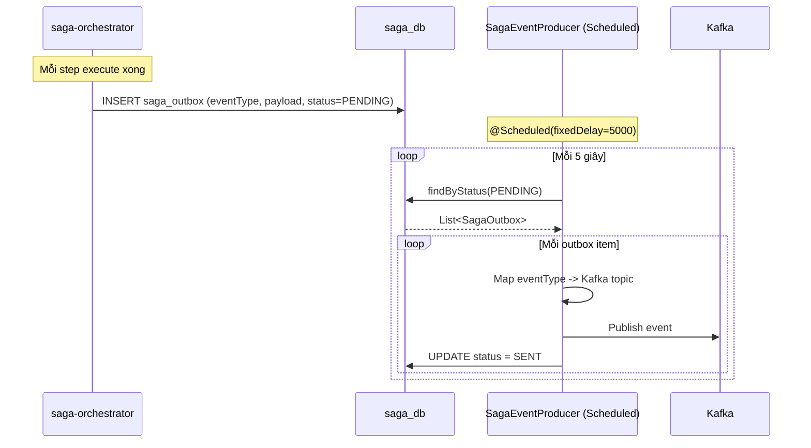
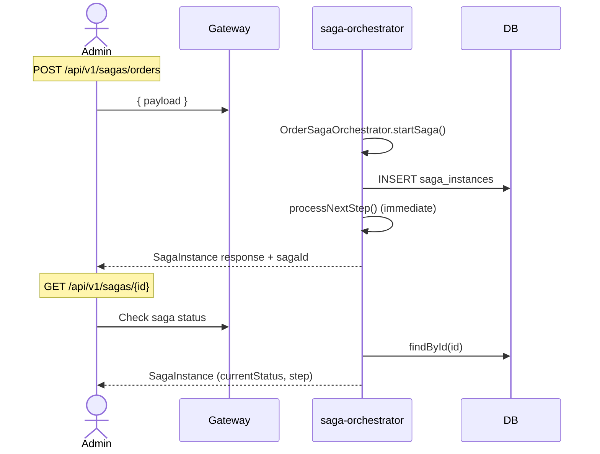
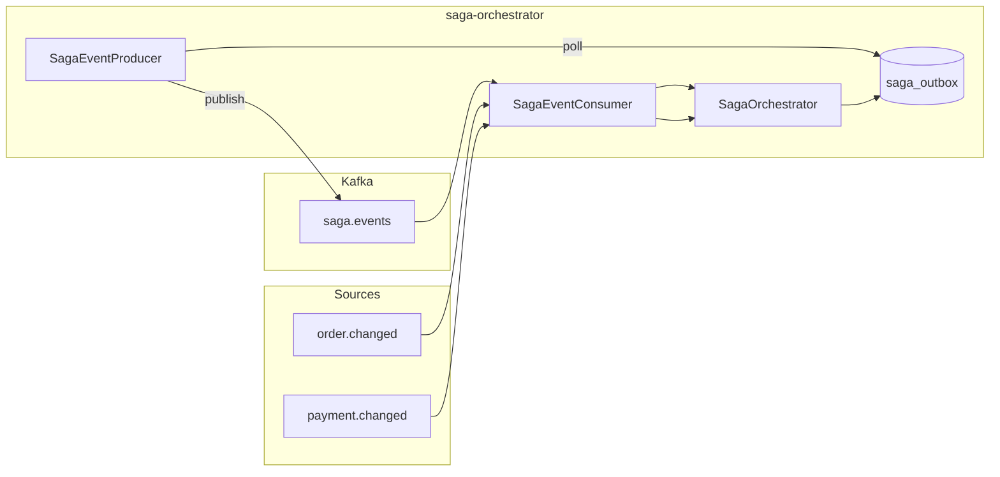

# 09 — Saga Orchestration Flow

## Tổng quan

Distributed transaction pattern cho luồng đặt hàng — đảm bảo consistency giữa nhiều microservices với cơ chế compensation.

**Services tham gia:**
- `saga-orchestrator` (port 8010) — orchestrator trung tâm
- `order-service` (port 8005) — tạo đơn hàng
- `payment-service` (port 8006) — xử lý thanh toán
- `product-service` (port 8003) — validate sản phẩm
- `notification-service` (port 8008) — gửi thông báo

**Database:** `saga_db` PostgreSQL — `saga_instances`, `saga_outbox`
**Kafka topics:** `saga.events`, `order.changed`, `payment.changed`, `inventory.reserve`, `payment.required`, `order.confirmed`, `notification.send`

---

## 1. Saga Flow Tổng Quan



---

## 2. Saga Steps & State Machine



### Saga Steps

| Step | Executor | Hành động | Compensation |
|------|----------|-----------|--------------|
| VALIDATE_PRODUCT | `ValidateProductStep` | Check productId tồn tại | — |
| RESERVE_INVENTORY | `ReserveInventoryStep` | Giữ hàng (simulated) | Release inventory |
| PROCESS_PAYMENT | `ProcessPaymentStep` | Validate amount > 0 | Refund payment |
| CREATE_ORDER | `CreateOrderStep` | Tạo order (simulated) | Cancel order |
| SEND_NOTIFICATION | `SendNotificationStep` | Gửi thông báo (simulated) | — |

---

## 3. Compensation Flow



### Compensation Logic

```
execute steps: [A, B, C, D, E]
fail at: C

compensate: [D(comp), C(comp)] → chỉ compensate những step đã execute
thực tế: [B(comp), A(comp)] → reverse order, skip step C vì chưa execute
```

---

## 4. Outbox Pattern



### Outbox Table

| Column | Type | Mô tả |
|--------|------|-------|
| id | UUID (PK) | |
| saga_instance_id | UUID (FK) | |
| event_type | VARCHAR | STEP_COMPLETED, STEP_FAILED |
| payload | TEXT (JSON) | Event data |
| status | VARCHAR | PENDING / SENT |
| created_at | TIMESTAMP | |

### Kafka Topics từ Outbox

| Event Type | Kafka Topic |
|------------|-------------|
| STEP_COMPLETED:VALIDATE_PRODUCT | (internal) |
| STEP_COMPLETED:RESERVE_INVENTORY | `inventory.reserve` |
| STEP_COMPLETED:PROCESS_PAYMENT | `payment.required` |
| STEP_COMPLETED:CREATE_ORDER | `order.confirmed` |
| STEP_COMPLETED:SEND_NOTIFICATION | `notification.send` |

---

## 5. Saga Instance Model

```json
{
  "id": "uuid",
  "sagaType": "ORDER_SAGA",
  "status": "STARTED",
  "currentStep": "VALIDATING_PRODUCT",
  "totalSteps": 5,
  "payload": {
    "orderId": "uuid",
    "buyerId": "uuid",
    "sellerId": "uuid",
    "productId": 1,
    "amount": 25000000
  },
  "startedAt": "2026-07-03T08:00:00",
  "completedAt": null,
  "failedAt": null,
  "failureReason": null
}
```

---

## 6. REST API



---

## 7. Event Flow



---

## 8. Xử lý lỗi

| Tình huống | Xử lý |
|------------|-------|
| Step execute fail | Gọi compensate() cho các step đã chạy |
| Compensation fail | Saga status = FAILED (manual intervention) |
| Outbox publish fail | Retry ở lần poll tiếp theo |
| Saga timeout | Cần implement timeout mechanism (chưa có) |
| Duplicate event | Idempotent handling qua sagaInstanceId |
