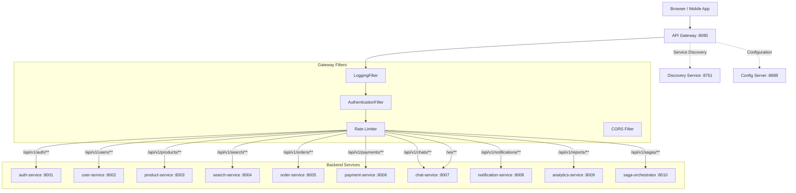
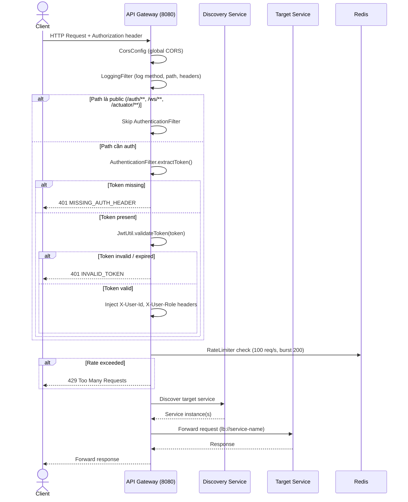
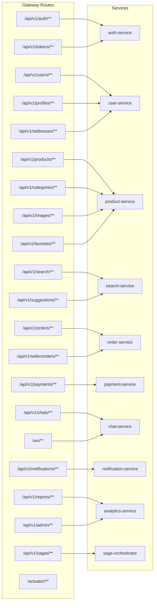
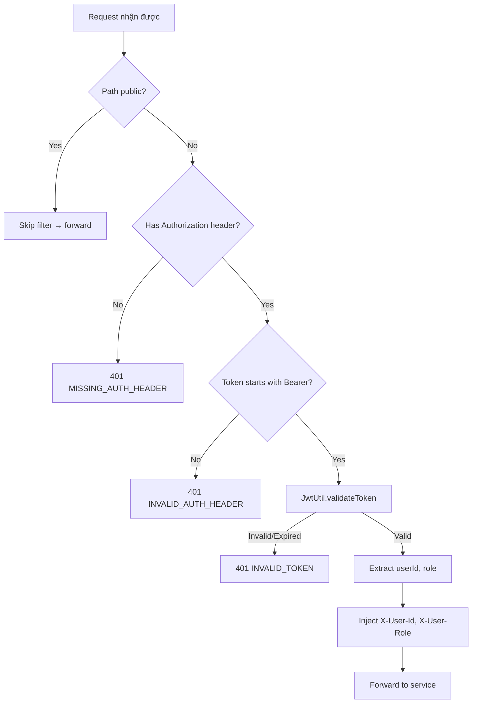
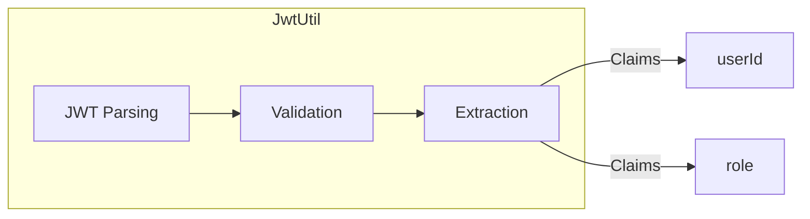
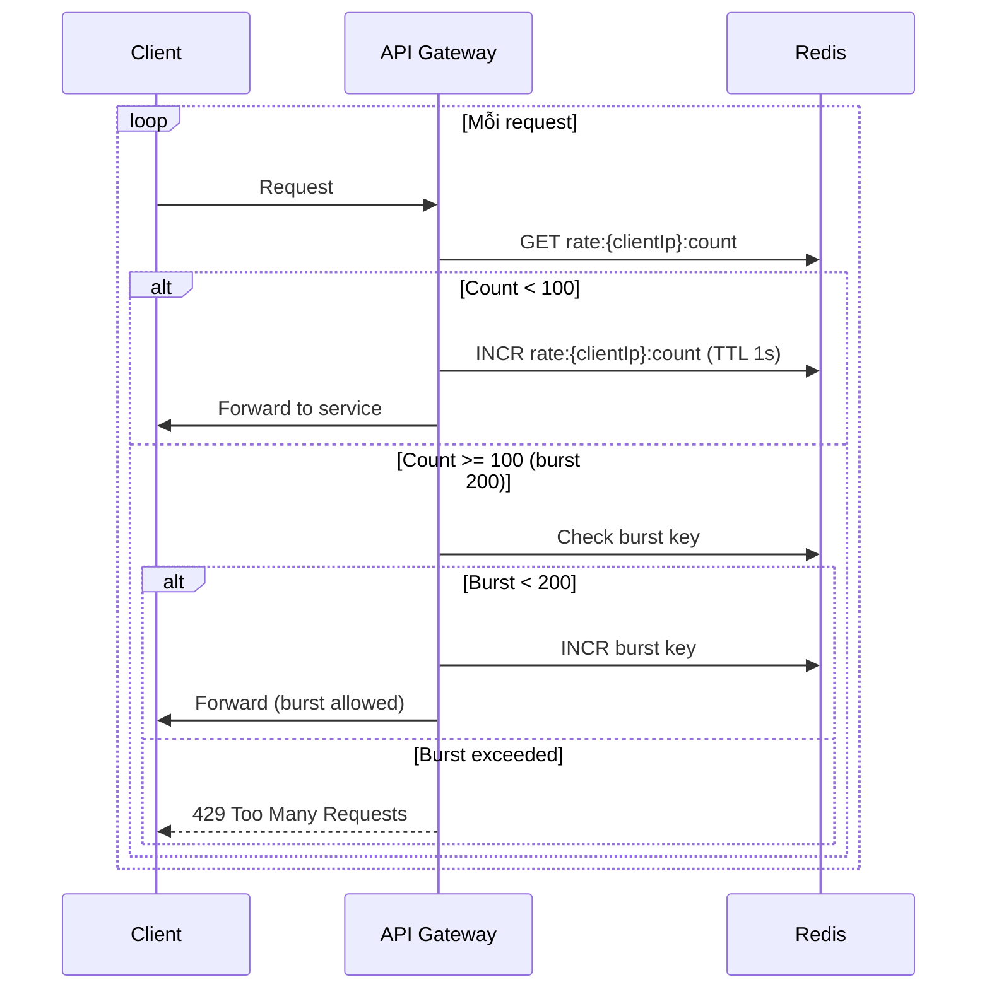

# 10 — API Gateway & Authentication Flow

## Tổng quan

API Gateway là entry point duy nhất cho tất cả request — xử lý routing, authentication, rate limiting, CORS, và logging.

**Services tham gia:**
- `api-gateway` (port 8080) — Spring Cloud Gateway
- `discovery-service` (port 8761) — Eureka service registry
- `config-server` (port 8888) — cấu hình
- `auth-service` (port 8001) — JWT verification

**Cache:** Redis — rate limiting
**Infrastructure:** Docker, Prometheus (monitoring)

---

## 1. Kiến trúc tổng quan



---

## 2. Request Lifecycle



---

## 3. Route Configuration



### Route Table

| # | Route ID | Path Pattern | Target (lb://) | Auth Required |
|---|----------|-------------|----------------|:---:|
| 1 | auth-service | `/api/v1/auth/**` | auth-service | No |
| 2 | tokens | `/api/v1/tokens/**` | auth-service | No |
| 3 | user-service | `/api/v1/users/**` | user-service | Yes |
| 4 | profiles | `/api/v1/profiles/**` | user-service | Yes |
| 5 | addresses | `/api/v1/addresses/**` | user-service | Yes |
| 6 | product-service | `/api/v1/products/**` | product-service | Yes |
| 7 | categories | `/api/v1/categories/**` | product-service | No (or Yes) |
| 8 | images | `/api/v1/images/**` | product-service | Yes |
| 9 | favorites | `/api/v1/favorites/**` | product-service | Yes |
| 10 | search-service | `/api/v1/search/**` | search-service | No |
| 11 | suggestions | `/api/v1/suggestions/**` | search-service | No |
| 12 | order-service | `/api/v1/orders/**` | order-service | Yes |
| 13 | seller-orders | `/api/v1/seller/orders/**` | order-service | Yes |
| 14 | payment-service | `/api/v1/payments/**` | payment-service | Yes |
| 15 | chat-service | `/api/v1/chats/**` | chat-service | Yes |
| 16 | ws | `/ws/**` | chat-service | No |
| 17 | notification-service | `/api/v1/notifications/**` | notification-service | Yes |
| 18 | reports | `/api/v1/reports/**` | analytics-service | Yes |
| 19 | admin | `/api/v1/admin/**` | analytics-service | Yes (ADMIN) |
| 20 | saga-orchestrator | `/api/v1/sagas/**` | saga-orchestrator | Yes |
| 21 | actuator | `/actuator/**` | (gateway) | No |

---

## 4. Authentication Filter — Chi tiết



### JWT Util — Xử lý



### Headers injected

| Header | Value | Mô tả |
|--------|-------|-------|
| `X-User-Id` | UUID string | ID người dùng |
| `X-User-Role` | ROLE_USER / ROLE_SELLER / ROLE_ADMIN | Vai trò |

---

## 5. Rate Limiter



| Config | Value |
|--------|-------|
| Default rate | 100 requests/second |
| Burst capacity | 200 requests |
| Redis key | `rate:{ip}:count` |
| TTL | 1 second |

---

## 6. CORS Configuration

```yaml
cors:
  allowed-origins:
    - "http://localhost:3000"   # Frontend dev
    - "http://localhost:3001"   # Frontend alt
  allowed-methods: GET, POST, PUT, DELETE, OPTIONS
  allowed-headers: "*"
  allow-credentials: true
```

---

## 7. Global Exception Handler

```mermaid
sequenceDiagram
    participant Client
    participant GW
    participant Service

    Client->>GW: Request
    GW->>Service: Forward
    Service--xGW: Error / Timeout
    GW->>GW: GlobalExceptionHandler

    alt Service timeout
        GW-->>Client: 504 Gateway Timeout
    alt Service unavailable
        GW-->>Client: 503 Service Unavailable
    alt Circuit breaker open
        GW-->>Client: 503 Circuit Breaker Open
    else Unknown error
        GW-->>Client: 500 Internal Server Error
    end
```

---

## 8. Monitoring & Observability

| Tính năng | Implementation |
|-----------|---------------|
| Metrics | Micrometer + Prometheus |
| Tracing | Spring Cloud Sleuth (Brave) |
| Logging | LoggingFilter (method, path, status, duration) |
| Health | `/actuator/health` |
| Info | `/actuator/info` |

---

## 9. Xử lý lỗi

| Tình huống | HTTP Status | Xử lý |
|------------|-------------|-------|
| Token missing | 401 | `MISSING_AUTH_HEADER` |
| Token invalid | 401 | `INVALID_TOKEN` |
| Token expired | 401 | `TOKEN_EXPIRED` |
| Rate limit exceeded | 429 | `RATE_LIMIT_EXCEEDED` |
| Service unavailable | 503 | Load balancer retry |
| CORS origin invalid | 403 | Blocked by CORS filter |
