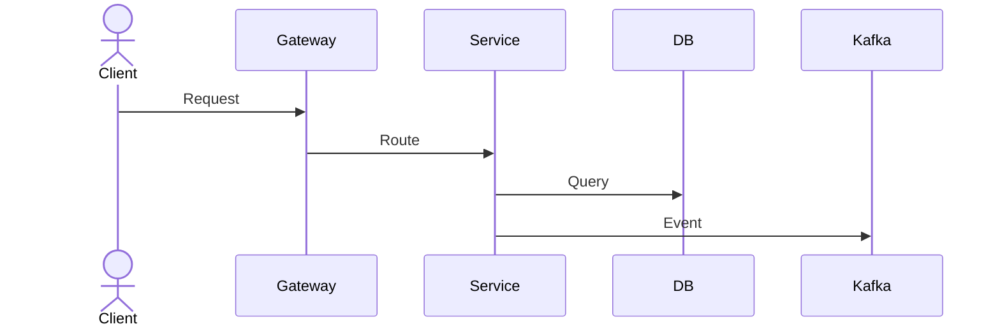

# Workflow Analysis — E-Commerce Microservices

> Danh mục toàn bộ luồng hoạt động (workflow) của hệ thống e-commerce microservices.
> Mỗi file phân tích chi tiết một luồng chính, bao gồm sơ đồ sequence, mô tả các bước, service tham gia, events, và xử lý lỗi.

## Danh sách workflows

| #  | Workflow | Mô tả | Services liên quan |
|----|----------|-------|--------------------|
| 01 | [User Registration & Authentication](./01-user-registration-auth-flow.md) | Đăng ký, đăng nhập, refresh token | auth-service, user-service, api-gateway |
| 02 | [Product Management](./02-product-management-flow.md) | CRUD sản phẩm, danh mục, hình ảnh, yêu thích | product-service, api-gateway |
| 03 | [Product Search](./03-product-search-flow.md) | Tìm kiếm full-text, filter, đồng bộ Elasticsearch | search-service, product-service |
| 04 | [Order Placement](./04-order-placement-flow.md) | Đặt hàng, state machine, cập nhật trạng thái | order-service, saga-orchestrator, payment-service, notification-service |
| 05 | [Payment Processing](./05-payment-processing-flow.md) | Thanh toán, ví điện tử, VNPay, refund | payment-service, order-service, notification-service |
| 06 | [Chat & Messaging](./06-chat-messaging-flow.md) | Nhắn tin realtime WebSocket, hội thoại | chat-service, redis |
| 07 | [Notification](./07-notification-flow.md) | Gửi thông báo email/SMS/push | notification-service, order-service, payment-service |
| 08 | [Analytics & Reporting](./08-analytics-reporting-flow.md) | Thống kê dashboard, report, admin logs | analytics-service |
| 09 | [Saga Orchestration](./09-saga-orchestration-flow.md) | Distributed transaction, outbox pattern, compensation | saga-orchestrator, tất cả services |
| 10 | [API Gateway & Auth](./10-api-gateway-auth-flow.md) | Routing, JWT filter, rate limiting, CORS | api-gateway, redis, discovery-service |

## Ký hiệu sơ đồ

Tất cả sơ đồ trong các file này sử dụng [Mermaid](https://mermaid.js.org/) `sequenceDiagram`.

## Cách đọc

Mỗi file workflow bao gồm:

1. **Tổng quan** — mục đích, service tham gia, bảng DB, Kafka topics
2. **Sơ đồ sequence** — flow chính dạng Mermaid
3. **Mô tả từng bước** — chi tiết các bước trong flow
4. **Xử lý lỗi** — các tình huống exception, rollback
5. **Event flow** — các Kafka event được publish/consume
6. **State machine** (nếu có) — biểu đồ trạng thái
